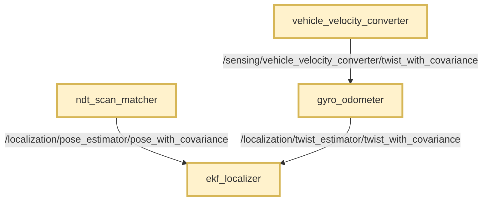
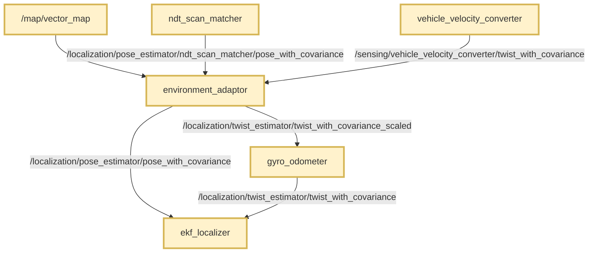

# Autoware Environment Adaptor Node

## Purpose

This package adapts localization inputs based on the driving environment.
It classifies the current position using Lanelet2 map polygons and applies environment-specific adjustments to:

- **Pose covariance** — replaces the NDT pose covariance with values tuned for the current environment before feeding the EKF localizer.
- **Twist longitudinal velocity** — scales the vehicle-reported longitudinal speed before it enters the gyro odometer.

This is useful in environments where localization accuracy or wheel-speed reliability changes predictably by location, such as tunnels (uniform road) or feature-poor road sections.

## Function

The node performs two independent adaptations on each callback:

| Input                        | Adaptation                                              | Output                       |
| ---------------------------- | ------------------------------------------------------- | ---------------------------- |
| `PoseWithCovarianceStamped`  | Replace covariance based on classified `environment_id` | `PoseWithCovarianceStamped`  |
| `TwistWithCovarianceStamped` | Multiply `linear.x` by `longitudinal_scale_factor`      | `TwistWithCovarianceStamped` |

> - This package does **not** modify pose position or orientation.
> - This package does **not** modify twist covariance or angular velocity.
> - Pose covariance values are defined in the **body frame** and rotated into the map frame using the current pose orientation.

## Assumptions

- The Lanelet2 vector map contains `degenerate_area` polygons that mark degenerate localization areas.
- NDT scan matcher is used as the pose estimator (`pose_source` includes `ndt`).
- Gyro odometer is used as the twist estimator (`twist_source` is `gyro_odom`).
- The NDT matcher outputs a pose with a fixed covariance that does not reflect the actual localization uncertainty in every environment.

## Requirements

- A geo-referenced Lanelet2 map with environment polygons (see [Map annotation guide](doc/map_annotation.md)).
- Parameter files that define environment IDs, pose covariances, and longitudinal scale factors for each environment.

## Description

Accurate covariance values are important for the Extended Kalman Filter (EKF) in `autoware_ekf_localizer`.
NDT scan matcher typically publishes poses with preset covariance that does not change with the driving environment.

Similarly, wheel-speed-based twist can be biased in certain road conditions (e.g., uniform tunnel sections).
This node allows per-environment tuning of both pose covariance and longitudinal velocity scale using map-based classification.

### Environment classification

`EnvironmentClassifier` loads Lanelet2 polygons whose `type` attribute is `degenerate_area`.
These areas are where geometric features are insufficient to constrain at least one translational or rotational degree of freedom in scan matching or lane line matching.
For each incoming pose, the node checks whether the vehicle position is inside any such polygon.

Classification priority for `longitudinal_scale_factor`:

1. Polygon attribute specified by `map_longitudinal_scale_factor_attribute` (default: `longitudinal_scale_factor`)
2. `default_longitudinal_scale_factor` (when the polygon has no such attribute)

The polygon `subtype` attribute is mapped to an `environment_id` via `area_subtype_<subtype>.environment_id` parameters.

### Pose covariance adaptation

Configured covariance matrices are 6×6 row-major arrays (36 elements) for `(x, y, z, roll, pitch, yaw)`.
They are stored in the body frame and rotated to the map frame before publishing.

If no `environment_<id>_output_pose_covariance` is configured for the classified environment ID, the input pose covariance is passed through unchanged.

### Flowcharts

#### Without this package (default)



#### With this package



## How to use this package

> **This package is disabled by default in Autoware. You need to manually enable it.**

### Enable conditions

The node is launched only when **all** of the following are true:

1. `pose_source` includes `ndt`
2. `twist_source` is `gyro_odom`
3. `use_autoware_environment_adaptor` is `true`

Set `use_autoware_environment_adaptor` to `true` in
`autoware_launch/tier4_universe_launch/tier4_localization_launch/launch/pose_twist_estimator/pose_twist_estimator.launch.xml`,
or override it from
`autoware_launch/autoware_launch/launch/components/tier4_localization_component.launch.xml`.

### Parameter file

The default parameter file is shipped with this package:

- Package default: [config/environment_adaptor.param.yaml](config/environment_adaptor.param.yaml)
- Autoware launch override: `autoware_launch/config/localization/environment_adaptor.param.yaml`

Override `environment_adaptor_param_path` to use a custom file.

### Standalone launch

```bash
ros2 launch autoware_environment_adaptor environment_adaptor.launch.xml
```

Remap arguments are available in [launch/environment_adaptor.launch.xml](launch/environment_adaptor.launch.xml).

## Node

`autoware_environment_adaptor_node`

### Subscribed topics

| Name                            | Type                                             | Description                                  |
| ------------------------------- | ------------------------------------------------ | -------------------------------------------- |
| `~/input/lanelet2_map`          | `autoware_map_msgs::msg::LaneletMapBin`          | Lanelet2 vector map (Transient Local QoS).   |
| `~/input/pose_with_covariance`  | `geometry_msgs::msg::PoseWithCovarianceStamped`  | Input pose from NDT scan matcher.            |
| `~/input/twist_with_covariance` | `geometry_msgs::msg::TwistWithCovarianceStamped` | Input twist from vehicle velocity converter. |

### Published topics

| Name                                | Type                                                | Description                                                |
| ----------------------------------- | --------------------------------------------------- | ---------------------------------------------------------- |
| `~/output/pose_with_covariance`     | `geometry_msgs::msg::PoseWithCovarianceStamped`     | Pose with environment-adapted covariance for EKF.          |
| `~/output/twist_with_covariance`    | `geometry_msgs::msg::TwistWithCovarianceStamped`    | Twist with scaled longitudinal velocity for gyro odometer. |
| `~/debug/environment_id`            | `autoware_internal_debug_msgs::msg::Int32Stamped`   | Classified environment ID.                                 |
| `~/debug/longitudinal_scale_factor` | `autoware_internal_debug_msgs::msg::Float64Stamped` | Applied longitudinal scale factor.                         |

### Parameters

Parameters are defined in [config/environment_adaptor.param.yaml](config/environment_adaptor.param.yaml).

{{ json_to_markdown(
  "localization/autoware_environment_adaptor/schema/environment_adaptor.schema.json") }}

See also [Map annotation guide](doc/map_annotation.md) for Lanelet2 polygon setup.

## Environment ID reference

The default parameter file defines the following environment IDs:

| ID  | Name               | Typical use case                                   |
| --- | ------------------ | -------------------------------------------------- |
| 0   | Normal environment | Default when outside any `degenerate_area` polygon |
| 1   | Uniform road       | Straight tunnel sections, uniform road surface     |
| 2   | Feature-poor road  | Areas with few LiDAR features for NDT matching     |

Add new environments by:

1. Defining a new `area_subtype_<name>.environment_id` mapping.
2. Adding `environment_<id>_output_pose_covariance`.
3. Annotating map polygons with the corresponding `subtype` (and `longitudinal_scale_factor` attribute if velocity scaling is needed).

## FAQ

### How is pose covariance applied when the map is not ready?

If the Lanelet2 map has not been received yet, classification falls back to `default_environment_id` and the corresponding covariance / scale factor.

### What happens if covariance parameters are missing?

If no `environment_<id>_output_pose_covariance` is configured for the classified environment ID, the node passes through the input pose covariance unchanged.

### Can this package be used with `autoware_pose_covariance_modifier`?

Both packages redirect the NDT output topic when enabled.
They serve different purposes (GNSS-based covariance switching vs. map-based environment adaptation) and are typically not used together.
Review your launch configuration carefully if you need to combine them.

### How are overlapping polygons handled?

Polygons are evaluated in map load order.
The first polygon that contains the vehicle position is used.

### Does twist scaling affect gyro odometer covariance?

No. Only `twist.twist.linear.x` is scaled. Covariance and other twist components are unchanged.
