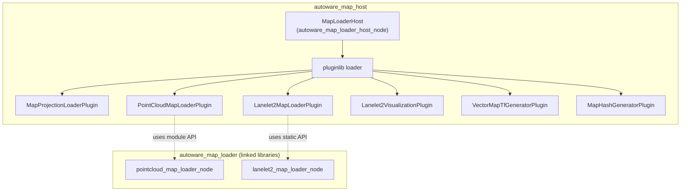

# autoware_map_host

`autoware_map_host` provides a single ROS 2 node that loads and publishes all map-related data used by Autoware. Map loading is implemented as a set of [pluginlib](https://github.com/ros/pluginlib) plugins orchestrated by `MapLoaderHost`.

This package complements `[autoware_map_loader](https://github.com/autowarefoundation/autoware_core/tree/main/map/autoware_map_loader)` in Autoware Core, which provides standalone map loader nodes and shared loader libraries.

## Role in the map stack

| Package                        | Responsibility                                                                                                                             |
| ------------------------------ | ------------------------------------------------------------------------------------------------------------------------------------------ |
| `autoware_map_loader` (Core)   | Standalone `pointcloud_map_loader` / `lanelet2_map_loader` nodes and their shared libraries                                                |
| `autoware_map_host` (Universe) | Integrated `map_loader` node with plugin-based loading of projection info, pointcloud map, Lanelet2 map, visualization, TF, and map hashes |

Use `autoware_map_host` when you want one node under `/map` that wires everything together (typical Autoware launch configuration). Use the Core nodes when you need individual loaders as separate processes.

## Architecture



Plugins share state through `MapLoaderData` (for example, map projection info loaded by `MapProjectionLoaderPlugin` is consumed by `Lanelet2MapLoaderPlugin` on startup).

Default plugin load order is defined in `config/map_loader_host.param.yaml`.

## Plugins

| Plugin                        | Description                                                                                                |
| ----------------------------- | ---------------------------------------------------------------------------------------------------------- |
| `MapProjectionLoaderPlugin`   | Loads `map_projector_info.yaml` and publishes `/map/map_projector_info`                                    |
| `PointCloudMapLoaderPlugin`   | Loads PCD map(s), publishes whole/downsampled maps, and exposes partial/differential/selected map services |
| `Lanelet2MapLoaderPlugin`     | Loads Lanelet2 OSM and publishes `/map/vector_map`                                                         |
| `Lanelet2VisualizationPlugin` | Publishes Lanelet2 visualization markers                                                                   |
| `VectorMapTfGeneratorPlugin`  | Broadcasts static TF for the map viewer frame                                                              |
| `MapHashGeneratorPlugin`      | Publishes map file hashes and exposes lanelet XML via Tier IV external API                                 |

## Dependency on `autoware_map_loader`

`PointCloudMapLoaderPlugin` and `Lanelet2MapLoaderPlugin` reuse implementation code from `autoware_map_loader`:

- **Lanelet2**: uses the public API in `autoware/map_loader/lanelet2_map_loader_node.hpp` and links `lanelet2_map_loader_node`.
- **Pointcloud**: includes vendored module headers under `include/` (for example `pointcloud_map_loader_module.hpp`) and links `pointcloud_map_loader_node` for the actual implementations.

The vendored headers are compile-time copies of the internal headers in `autoware_map_loader/src/pointcloud_map_loader/`. They must be kept in sync with the Core package version you build against. A future refactor in Core may expose a public pointcloud API and remove the need for these copies.

## How to run

### Launch file

```bash
ros2 launch autoware_map_host map_loader.launch.xml \
  pointcloud_map_path:=/path/to/pointcloud_map.pcd \
  pointcloud_map_metadata_path:=/path/to/pointcloud_map_metadata.yaml \
  lanelet2_map_path:=/path/to/lanelet2_map.osm \
  map_projector_info_path:=/path/to/map_projector_info.yaml \
  pointcloud_map_loader_param_path:=$(ros2 pkg prefix autoware_map_loader)/share/autoware_map_loader/config/pointcloud_map_loader.param.yaml \
  lanelet2_map_loader_param_path:=$(ros2 pkg prefix autoware_map_loader)/share/autoware_map_loader/config/lanelet2_map_loader.param.yaml \
  map_tf_generator_param_path:=/path/to/map_tf_generator.param.yaml \
  map_projection_loader_param_path:=/path/to/map_projection_loader.param.yaml
```

Parameter files for pointcloud and Lanelet2 loader options are provided by `autoware_map_loader`. Other parameter files depend on your launch setup.

### Standalone node

```bash
ros2 run autoware_map_host autoware_map_loader_host_node --ros-args \
  --params-file $(ros2 pkg prefix autoware_map_host)/share/autoware_map_host/config/map_loader_host.param.yaml
```

## Parameters

### Host

`config/map_loader_host.param.yaml` sets `plugin_names`, the ordered list of plugins to load.

### Per-plugin parameters

Pointcloud and Lanelet2 plugin parameters follow the schemas shared with `autoware_map_loader`:

- Pointcloud: see [autoware_map_loader README — pointcloud_map_loader](https://github.com/autowarefoundation/autoware_core/tree/main/map/autoware_map_loader#pointcloud_map_loader) and `schema/pointcloud_map_loader.schema.json`
- Lanelet2: see [autoware_map_loader README — lanelet2_map_loader](https://github.com/autowarefoundation/autoware_core/tree/main/map/autoware_map_loader#lanelet2_map_loader) and `schema/lanelet2_map_loader.schema.json`

## Interfaces (under `/map` namespace)

When launched via `map_loader.launch.xml`, the node runs in the `map` namespace. Key interfaces include:

| Interface                           | Type    | Plugin                    |
| ----------------------------------- | ------- | ------------------------- |
| `map_projector_info`                | topic   | MapProjectionLoaderPlugin |
| `pointcloud_map`                    | topic   | PointCloudMapLoaderPlugin |
| `pointcloud_map_metadata`           | topic   | PointCloudMapLoaderPlugin |
| `vector_map`                        | topic   | Lanelet2MapLoaderPlugin   |
| `get_partial_pointcloud_map`        | service | PointCloudMapLoaderPlugin |
| `get_differential_pointcloud_map`   | service | PointCloudMapLoaderPlugin |
| `get_selected_pointcloud_map`       | service | PointCloudMapLoaderPlugin |
| `/api/autoware/get/map/info/hash`   | topic   | MapHashGeneratorPlugin    |
| `/api/autoware/get/map/lanelet/xml` | service | MapHashGeneratorPlugin    |

See `launch/map_loader.launch.xml` for topic/service remaps.

## Package layout

```text
autoware_map_host/
├── config/           # Host plugin list
├── include/
│   ├── autoware/map_loader/   # Host and plugin headers
│   └── *.hpp                  # Vendored pointcloud module headers (sync with Core)
├── launch/           # Integrated map loader launch
├── schema/           # Parameter schemas (shared with autoware_map_loader)
└── src/map_loader_host/
    ├── map_loader_host.cpp
    └── plugins/      # Plugin implementations
```

## Building

```bash
colcon build --packages-select autoware_map_loader autoware_map_host
```

Both packages must be present: `autoware_map_host` links against libraries exported by `autoware_map_loader`.
