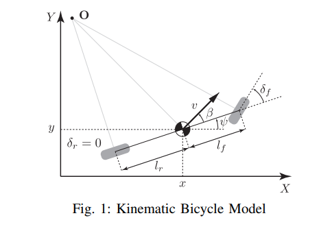

# Models used in this module

## Tracking model

<!-- cspell:ignore CTRV -->

### CTRV model [1]

CTRV model is a model that assumes constant turn rate and velocity magnitude.

- state transition equation

$$
\begin{aligned}
x_{k+1} & = x_{k} + v_{k} \cos(\psi_k) \cdot {d t} \\
y_{k+1} & = y_{k} + v_{k} \sin(\psi_k) \cdot {d t} \\
\psi_{k+1} & = \psi_k + \dot\psi_{k} \cdot {d t} \\
v_{k+1} & = v_{k} \\
\dot\psi_{k+1} & = \dot\psi_{k} \\
\end{aligned}
$$

- jacobian

$$
A = \begin{bmatrix}
1 & 0 & -v \sin(\psi) \cdot dt & \cos(\psi) \cdot dt & 0 \\
0 & 1 & v \cos(\psi) \cdot dt & \sin(\psi) \cdot dt & 0 \\
0 & 0 & 1 & 0 & dt \\
0 & 0 & 0 & 1 & 0 \\
0 & 0 & 0 & 0 & 1 \\
\end{bmatrix}
$$

### Kinematic bicycle model [2]

Static bicycle model uses two wheel positions (front and rear) with longitudinal and lateral velocities to represent vehicle motion.
The merit of using this model is that it can handle both longitudinal and lateral motion while maintaining vehicle orientation through wheel base geometry.

- **state variable**
  - rear wheel position( $x_1,y_1$ ), front wheel position( $x_2,y_2$ ), longitudinal velocity( $v_{long}$ ), and lateral velocity ( $v_{lat}$ )
  - $[x_{1k}, y_{1k}, x_{2k}, y_{2k}, v_{long,k}, v_{lat,k} ]^\mathrm{T}$
- **Prediction Equation**
  - $dt$: sampling time
  - $wheel\_base = \sqrt{(x_2 - x_1)^2 + (y_2 - y_1)^2}$ : distance between front and rear wheels
  - $\cos\theta = \frac{x_2 - x_1}{wheel\_base}$, $\sin\theta = \frac{y_2 - y_1}{wheel\_base}$ : vehicle orientation components
  - $\gamma = \frac{\ln(2)}{half\_life}$ : decay constant for lateral velocity (half-life = 0.8s)

$$
\begin{aligned}
x_{1,k+1} & = x_{1,k} + v_{long,k} \cos\theta \cdot dt \\
y_{1,k+1} & = y_{1,k} + v_{long,k} \sin\theta \cdot dt \\
x_{2,k+1} & = x_{2,k} + v_{long,k} \cos\theta \cdot dt - v_{lat,k} \sin\theta \cdot dt \\
y_{2,k+1} & = y_{2,k} + v_{long,k} \sin\theta \cdot dt + v_{lat,k} \cos\theta \cdot dt \\
v_{long,k+1} & = v_{long,k} \\
v_{lat,k+1} & = v_{lat,k} \cdot e^{-\gamma \cdot dt}
\end{aligned}
$$

- **Jacobian Matrix**

$$
A = \begin{bmatrix}
1 - \frac{v_{long} \cdot dt}{wheel\_base} & 0 & \frac{v_{long} \cdot dt}{wheel\_base} & 0 & \cos\theta \cdot dt & 0 \\
0 & 1 - \frac{v_{long} \cdot dt}{wheel\_base} & 0 & \frac{v_{long} \cdot dt}{wheel\_base} & \sin\theta \cdot dt & 0 \\
-\frac{v_{long} \cdot dt}{wheel\_base} & \frac{v_{lat} \cdot dt}{wheel\_base} & 1 + \frac{v_{long} \cdot dt}{wheel\_base} & -\frac{v_{lat} \cdot dt}{wheel\_base} & \cos\theta \cdot dt & -\sin\theta \cdot dt \\
-\frac{v_{lat} \cdot dt}{wheel\_base} & \frac{v_{long} \cdot dt}{wheel\_base} & \frac{v_{lat} \cdot dt}{wheel\_base} & 1 + \frac{v_{long} \cdot dt}{wheel\_base} & \sin\theta \cdot dt & \cos\theta \cdot dt \\
0 & 0 & 0 & 0 & 1 & 0 \\
0 & 0 & 0 & 0 & 0 & e^{-\gamma \cdot dt}
\end{bmatrix}
$$

#### remarks on the output

The output twist in the vehicle coordinate system is calculated from the state variables:

- Vehicle center position: $x = \frac{x_1 + x_2}{2}$, $y = \frac{y_1 + y_2}{2}$
- Vehicle yaw: $\psi = \arctan2(y_2 - y_1, x_2 - x_1)$
- Longitudinal velocity: $v_x = v_{long}$
- Lateral velocity: $v_y = \frac{v_{lat}}{wheel\_pos\_ratio}$
- Angular velocity: $\omega_z = \frac{v_{lat}}{wheel\_base}$

The lateral velocity decays exponentially over time to model the natural stabilization of vehicle slip motion.

## References

<!-- cspell:ignore Wanielik, Gerd, ICIF -->

[1] Schubert, Robin & Richter, Eric & Wanielik, Gerd. (2008). Comparison and evaluation of advanced motion models for vehicle tracking. 1 - 6. 10.1109/ICIF.2008.4632283.

<!-- cspell:ignore Pfeiffer, Schildbach, Georg, Borrelli, Francesco -->

[2] Kong, Jason & Pfeiffer, Mark & Schildbach, Georg & Borrelli, Francesco. (2015). Kinematic and dynamic vehicle models for autonomous driving control design. 1094-1099. 10.1109/IVS.2015.7225830.
