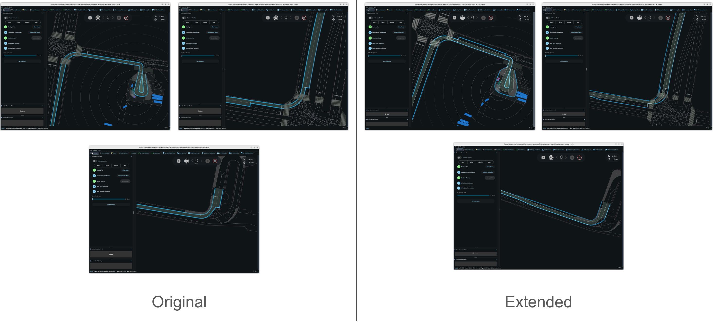

# autoware_avoidance_target_detector

Experimental toy package for developing auxiliary planning functions. The reference node (`AvoidanceTargetDetectorNode`) shows how to wire the library; the reusable pieces are **`ExtendedRouteHandler`** (route / boundary construction) and the object selectors (avoidance target and driving-along vehicle filtering).

The object-selection logic is templated on the object message type (`ObjectSelectorBase<ObjectT>`) and exposed as two concrete types:

- **`PredictedObjectSelector`** (`= ObjectSelectorBase<PredictedObject>`) — for `autoware_perception_msgs/msg/PredictedObjects`
- **`TrackedObjectSelector`** (`= ObjectSelectorBase<TrackedObject>`) — for `autoware_perception_msgs/msg/TrackedObjects`

Choose **one** of these based on which object topic you subscribe to. You do **not** need both. Per-object state is held by `AvoidanceTargetDetectorBase<ObjectT>`, aliased as **`AvoidanceTargetDetectorPredicted`** and **`AvoidanceTargetDetectorTracked`**.

When integrating into another package, own a route handler and the selector that matches your subscription:

```cpp
std::shared_ptr<ExtendedRouteHandler> extended_route_handler_;

// Use exactly one of the following:
PredictedObjectSelector object_selector_;        // if you subscribe to PredictedObjects
// TrackedObjectSelector object_selector_;       // if you subscribe to TrackedObjects
```

Headers:

- `autoware/avoidance_target_detector/boundary.hpp` — `ExtendedRouteHandler`, `RouteBounds`, `to_path_msg`
- `autoware/avoidance_target_detector/object_filtering.hpp` — `PredictedObjectSelector`, `TrackedObjectSelector`

---

## Required subscriptions

Rebuild `ExtendedRouteHandler` whenever the **map** or **route** changes. On each **objects** update, call `update_objects()` first, then `get_avoidance_targets()` and/or `get_driving_along_vehicles()` (with the latest trajectory and route handler).

| Topic (reference node)                             | Message type                               | Role                                                  |
| -------------------------------------------------- | ------------------------------------------ | ----------------------------------------------------- |
| `~/input/lanelet_map_bin`                          | `autoware_map_msgs/msg/LaneletMapBin`      | Vector map. QoS: transient local.                     |
| `~/input/route`                                    | `autoware_planning_msgs/msg/LaneletRoute`  | Current route. QoS: transient local.                  |
| `~/input/trajectory`                               | `autoware_planning_msgs/msg/Trajectory`    | Reference trajectory for deviation / distance checks. |
| `~/input/objects` **or** `~/input/tracked_objects` | `PredictedObjects` **or** `TrackedObjects` | Object stream to filter. Subscribe to **only one**.   |

Until map, route, and trajectory are available, boundary and object-selection APIs are not meaningful.

---

## Integration flow

1. On map or route update: construct `ExtendedRouteHandler`, call `create_map()`, then read cached bounds (see below).
2. On each objects callback: call `update_objects()`, select route bounds, optionally publish via `to_path_msg`, then call `get_avoidance_targets()` and/or `get_driving_along_vehicles()`.

Minimal pattern (see `src/node.cpp`):

```cpp
// After map + route received:
extended_route_handler_ = std::make_shared<ExtendedRouteHandler>(*map_bin_, *route_);
extended_route_handler_->create_map();

// Each cycle (with trajectory + objects of the chosen type):
const auto & bounds = extended_route_handler_->get_extended_route_bounds();  // or get_original_route_bounds()
pub_drivable_area_path_->publish(to_path_msg(bounds, trajectory));

object_selector_.update_objects(
  get_clock()->now(), objects, trajectory, *extended_route_handler_, ego_trajectory_,
  ego_trajectory_built);

const auto targets = object_selector_.get_avoidance_targets(objects, trajectory, bounds);

const auto driving_along = object_selector_.get_driving_along_vehicles(objects);
```

Parameter `use_extended_route_bounds` (reference node) switches between original and extended route bounds for the drivable area.

Parameter `use_tracked_objects` (reference node, default `false`) picks which object source the reference node uses. Both sources are **not** required:

- `false` — subscribe only to `~/input/objects` (`PredictedObjects`) and run `PredictedObjectSelector`
- `true` — subscribe only to `~/input/tracked_objects` (`TrackedObjects`) and run `TrackedObjectSelector`

Only the chosen subscription and its matching output publishers are created.

---

## API overview

### `ExtendedRouteHandler`

Builds a route-local lanelet map, extended lanelet segments, and cached left/right route bounds.

#### Constructor

```cpp
ExtendedRouteHandler(const LaneletMapBin & map, const LaneletRoute & route);
```

| Argument | Description                                                                                                                                                                           |
| -------- | ------------------------------------------------------------------------------------------------------------------------------------------------------------------------------------- |
| `map`    | Full vector map (`LaneletMapBin`). Stored in an internal `RouteHandler`; must contain all lanelets referenced by `route`.                                                             |
| `route`  | Current mission route (`LaneletRoute`). Must have at least one non-empty segment. Does not need to match the latest map revision if IDs are stable, but map/route must be consistent. |

Does **not** build anything yet — call `create_map()` next.

#### `create_map()`

No arguments.

**Preconditions:** Handler constructed with valid `map` and `route`.

**Effect:** Builds the goal-purpose routing graph, extended lanelet segments, `route_map_` (route lanelets + nearby `road_border` linestrings), `route_map_routing_graph_` (routing graph over `route_map_` only), and caches `original_route_bounds_` / `extended_route_bounds_`.

**When to call:** Once after construction, and again whenever the subscribed map or route message changes.

#### `get_road_borders()`

No arguments.

| Returns                              | Description                                                                                                                                   |
| ------------------------------------ | --------------------------------------------------------------------------------------------------------------------------------------------- |
| `std::vector<lanelet::LineString2d>` | All `type=road_border` linestrings in `route_map_` (2D). Empty if `create_map()` has not been called or no borders were found near the route. |

**Preconditions:** `create_map()` completed.

#### `get_original_route_bounds()` / `get_extended_route_bounds()`

No arguments.

| Returns                                         | Description                                                                                             |
| ----------------------------------------------- | ------------------------------------------------------------------------------------------------------- |
| `const std::pair<LineString2d, LineString2d> &` | `.first`: concatenated **left** bound. `.second`: concatenated **right** bound. Map-frame 2D polylines. |

| Method                        | Bound source                                                                                                   |
| ----------------------------- | -------------------------------------------------------------------------------------------------------------- |
| `get_original_route_bounds()` | Route-message primitives only (per segment: left bound of leftmost lanelet, right bound of rightmost lanelet). |
| `get_extended_route_bounds()` | Extended primitives (lateral expansion + sibling lanelets where found). Wider corridor than original.          |

**Preconditions:** `create_map()` completed. Values are cached and do not change until the next `create_map()`.

#### `get_near_segment_polygon(prev_end_point, following_end_point)`

```cpp
lanelet::BasicPolygon2d get_near_segment_polygon(
  const geometry_msgs::msg::Point & prev_end_point,
  const geometry_msgs::msg::Point & following_end_point) const;
```

| Argument              | Description                                                                                               |
| --------------------- | --------------------------------------------------------------------------------------------------------- |
| `prev_end_point`      | Start of the query range on the route (reference node: oldest point on the built ego trajectory history). |
| `following_end_point` | End of the query range (reference node: last point of the subscribed planning trajectory).                |

| Returns                   | Description                                                                                                                                                   |
| ------------------------- | ------------------------------------------------------------------------------------------------------------------------------------------------------------- |
| `lanelet::BasicPolygon2d` | Polygon covering extended route segments between the two points (left bounds forward + right bounds reversed). Empty if segment lookup or bounds build fails. |

**Preconditions:** `create_map()` completed.



#### `get_velocity_limit(point)`

```cpp
std::optional<double> get_velocity_limit(const lanelet::BasicPoint2d & point) const;
std::optional<double> get_velocity_limit(const lanelet::Point2d & point) const;
std::optional<double> get_velocity_limit(const geometry_msgs::msg::Point & point) const;
```

Looks up the speed limit [m/s] at a map position on the route map.

| Argument | Description                                                                                                               |
| -------- | ------------------------------------------------------------------------------------------------------------------------- |
| `point`  | Query position (map frame). Overloads accept `lanelet::BasicPoint2d`, `lanelet::Point2d`, or `geometry_msgs::msg::Point`. |

| Returns                 | Description                                                                      |
| ----------------------- | -------------------------------------------------------------------------------- |
| `std::optional<double>` | Speed limit in m/s, or `std::nullopt` if no limit can be resolved for the point. |

**Behavior:**

1. Finds up to 5 nearest lanelets on `route_map_` that contain the point.
2. For each lanelet, reads its speed-limit attribute when present.
3. If a lanelet has no speed-limit attribute but is a `road_shoulder` or `pedestrian_lane`, falls back to the left/right neighbor from the extended routing graph.
4. When multiple limits are found, returns the **minimum**.

**Preconditions:** `create_map()` completed (`route_map_` and `extended_routing_graph_` ready).

**Example:**

```cpp
const auto & ego_position = trajectory.points.front().pose.position;
const auto velocity_limit = extended_route_handler_->get_velocity_limit(ego_position);
if (velocity_limit) {
  // *velocity_limit is in m/s
}
```

---

### Route bounds and `to_path_msg`

#### `RouteBounds`

```cpp
using RouteBounds = std::pair<lanelet::LineString2d, lanelet::LineString2d>;
```

Left and right route boundary linestrings from `get_original_route_bounds()` or `get_extended_route_bounds()`. Passed directly to `ObjectSelector::get_avoidance_targets()` and `to_path_msg()`.

#### `to_path_msg(bounds, trajectory)`

```cpp
Path to_path_msg(const RouteBounds & bounds, const Trajectory & trajectory);
```

| Argument     | Description                                                                                                                                                                                                                                      |
| ------------ | ------------------------------------------------------------------------------------------------------------------------------------------------------------------------------------------------------------------------------------------------ |
| `bounds`     | Left and right route bounds. Each `LineString2d` is converted point-by-point to `geometry_msgs/Point` (z = 0) for `Path::left_bound` / `Path::right_bound`.                                                                                      |
| `trajectory` | Reference trajectory. `trajectory.header` is copied into the path. Each `TrajectoryPoint` is copied into `Path::points` as the path centerline (pose and velocities preserved). Used for RViz / downstream path consumers, not for filter logic. |

| Returns                           | Description                                                                       |
| --------------------------------- | --------------------------------------------------------------------------------- |
| `autoware_planning_msgs/msg/Path` | Visualization / debug output. Bounds from `bounds`; centerline from `trajectory`. |

---

### `ObjectSelectorBase<ObjectT>` (`PredictedObjectSelector` / `TrackedObjectSelector`)

Per-object Bayesian filters are updated via `update_objects()`. Getter methods (`get_avoidance_targets()`, `get_driving_along_vehicles()`) read the latest filter state. Reuse the same selector instance across callbacks.

Pick the selector that matches your object subscription — you only need one. The signatures below use `PredictedObjects`; for tracked objects, substitute `TrackedObjects` / `TrackedObjectSelector` the same way.

#### `update_objects()`

```cpp
void update_objects(
  const rclcpp::Time & current_time,
  const PredictedObjects & objects,
  const Trajectory & trajectory,
  const ExtendedRouteHandler & extended_route_handler,
  const autoware::experimental::trajectory::Trajectory<TrajectoryPoint> & ego_trajectory,
  bool ego_trajectory_built);
```

| Argument                 | Description                                                                                                                                                                                                                                                                 |
| ------------------------ | --------------------------------------------------------------------------------------------------------------------------------------------------------------------------------------------------------------------------------------------------------------------------- |
| `current_time`           | ROS time for this update cycle. Used for filter staleness, hysteresis timing, and Bayesian updates. Typically `node->get_clock()->now()`.                                                                                                                                   |
| `objects`                | Full objects message for the current frame (`PredictedObjects` or `TrackedObjects`, matching the selector). Every object in `objects.objects` is observed; objects not seen for longer than `FilterManagerParams::stale_threshold_seconds` are removed from internal state. |
| `trajectory`             | Reference trajectory (same source as subscribed trajectory). Must have **at least two points** for deviation and distance checks.                                                                                                                                           |
| `extended_route_handler` | Handler with built `route_map_` and `route_map_routing_graph_`. Used for driving-along spatial checks during observation.                                                                                                                                                   |
| `ego_trajectory`         | Built ego history trajectory. Used with `trajectory` to build the near-segment polygon and resolve ego lanelets.                                                                                                                                                            |
| `ego_trajectory_built`   | Whether `ego_trajectory` is valid. When false, driving-along spatial checks are skipped for that cycle.                                                                                                                                                                     |

Call once per objects callback before any getter in the same cycle. Runs per-object Bayesian observation, driving-along spatial evaluation (for moving objects of interest), and stale pruning. Hysteresis tracking runs inside each getter.

#### `get_avoidance_targets()`

```cpp
PredictedObjects get_avoidance_targets(
  const PredictedObjects & objects,
  const Trajectory & trajectory,
  const RouteBounds & route_bounds);
```

| Argument       | Description                                                                                                                                                                                     |
| -------------- | ----------------------------------------------------------------------------------------------------------------------------------------------------------------------------------------------- |
| `objects`      | Same objects message passed to `update_objects()` for this cycle.                                                                                                                               |
| `trajectory`   | Reference trajectory. Used for on-trajectory deviation, longitudinal extent filtering, and lateral corridor checks.                                                                             |
| `route_bounds` | Left/right corridor for lateral filtering. Objects whose footprint lies entirely outside the bounds are removed. Typically from `get_original_route_bounds()` or `get_extended_route_bounds()`. |

| Returns                               | Description                                                                                 |
| ------------------------------------- | ------------------------------------------------------------------------------------------- |
| `PredictedObjects` / `TrackedObjects` | Subset of input objects classified as stationary avoidance targets. Matches the input type. |

**Brief behavior:**

- Runs avoidance-target hysteresis tracking, then keeps objects whose per-object filter reports `is_stationary_avoidance_target()` (interest + stationary + deviated from trajectory, with hysteresis).
- Removes objects outside trajectory longitudinal range or outside the route corridor.
- Filter tuning constants: `parameter.hpp` (`OnTrajectoryDValidationParams`, `FilterManagerParams`, `MovingObjectFilterParams`, etc.).

#### `get_driving_along_vehicles()`

```cpp
PredictedObjects get_driving_along_vehicles(const PredictedObjects & objects);
// or, when using tracked objects:
// TrackedObjects get_driving_along_vehicles(const TrackedObjects & objects);
```

Selects **moving vehicles along the extended route corridor** near ego (e.g. traffic in sibling / adjacent lanes), complementary to stationary `get_avoidance_targets()`.

**Preconditions:** `update_objects()` called for the same `objects` in the same cycle.

| Argument  | Description                                                                                                |
| --------- | ---------------------------------------------------------------------------------------------------------- |
| `objects` | Same objects message passed to `update_objects()` for this cycle (`PredictedObjects` or `TrackedObjects`). |

| Returns                               | Description                                                                           |
| ------------------------------------- | ------------------------------------------------------------------------------------- |
| `PredictedObjects` / `TrackedObjects` | Subset of input objects whose state is `is_moving_vehicle()`. Matches the input type. |

**Selection criteria:**

1. **Moving-vehicle state** — `is_moving_vehicle()` after driving-along hysteresis (updated when this getter is called).

Spatial checks (near-segment overlap, lanelet on `route_map_`, not routably connected to ego without lane change) are evaluated during `update_objects()` for moving objects of interest and folded into the driving-along candidate signal before tracking.

**Reference node outputs** (only the pair matching `use_tracked_objects` is published):

| Topic                                     | Message type                                    | When                         |
| ----------------------------------------- | ----------------------------------------------- | ---------------------------- |
| `~/output/driving_along_vehicles`         | `autoware_perception_msgs/msg/PredictedObjects` | `use_tracked_objects:=false` |
| `~/output/tracked_driving_along_vehicles` | `autoware_perception_msgs/msg/TrackedObjects`   | `use_tracked_objects:=true`  |
| `~/debug/near_segment_polygon`            | `visualization_msgs/msg/MarkerArray`            | always                       |

---

## Reference launch

```bash
ros2 launch autoware_avoidance_target_detector avoidance_target_detector.launch.xml
```

Default remaps are defined in `launch/avoidance_target_detector.launch.xml`.

| Output (reference node)                   | Default topic                                                                                                  |
| ----------------------------------------- | -------------------------------------------------------------------------------------------------------------- |
| `~/output/avoidance_targets`              | `/planning/avoidance_target_detector/output/avoidance_targets` (when `use_tracked_objects:=false`)             |
| `~/output/driving_along_vehicles`         | `/planning/avoidance_target_detector/output/driving_along_vehicles` (when `use_tracked_objects:=false`)        |
| `~/output/tracked_avoidance_targets`      | `/planning/avoidance_target_detector/output/tracked_avoidance_targets` (when `use_tracked_objects:=true`)      |
| `~/output/tracked_driving_along_vehicles` | `/planning/avoidance_target_detector/output/tracked_driving_along_vehicles` (when `use_tracked_objects:=true`) |
| `~/output/drivable_area`                  | `/planning/avoidance_target_detector/output/drivable_area`                                                     |
| `~/debug/near_segment_polygon`            | `/planning/avoidance_target_detector/debug/near_segment_polygon`                                               |

---

## Package layout

| File                                            | Role                                                                |
| ----------------------------------------------- | ------------------------------------------------------------------- |
| `boundary.hpp` / `boundary.cpp`                 | `ExtendedRouteHandler`, traffic rules, `RouteBounds`, `to_path_msg` |
| `object_filtering.hpp` / `object_filtering.cpp` | `PredictedObjectSelector`, `TrackedObjectSelector`, filters         |
| `parameter.hpp` / `parameter.cpp`               | Shared constants                                                    |
| `node.hpp` / `node.cpp`                         | Example ROS 2 node                                                  |

This package is not intended for production use as-is; copy or depend on the library pieces above when moving logic into the target package.
