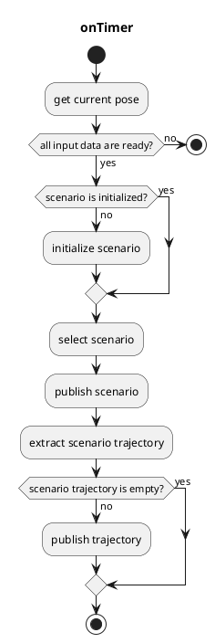
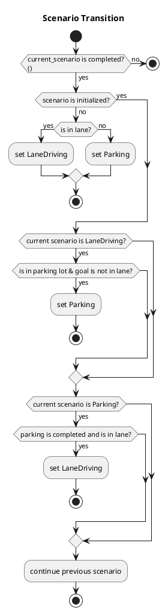

# default_scenario_selector

## default_scenario_selector_node

`default_scenario_selector_node` is a ROS 2 node that switches trajectories between **LaneDriving** and **Parking** scenarios.

### Input topics

| Name                             | Type                                  | Description                                           |
|----------------------------------|---------------------------------------|-------------------------------------------------------|
| `~input/lane_driving/trajectory` | `autoware_planning_msgs::Trajectory`  | Trajectory of the LaneDriving scenario                |
| `~input/parking/trajectory`      | `autoware_planning_msgs::Trajectory`  | Trajectory of the Parking scenario                    |
| `~input/lanelet_map`             | `autoware_map_msgs::msg::LaneletMapBin` | Lanelet map                                         |
| `~input/route`                   | `autoware_planning_msgs::LaneletRoute` | Route and goal pose                                  |
| `~input/odometry`                | `nav_msgs::Odometry`                  | Used to check whether the vehicle is stopped          |
| `is_parking_completed`           | `bool` (rosparam)                     | Whether all split trajectories of Parking are published |

### Output topics

| Name                 | Type                                         | Description                                    |
|----------------------|----------------------------------------------|------------------------------------------------|
| `~output/scenario`   | `autoware_internal_planning_msgs::Scenario`  | Current scenario and scenarios to be activated |
| `~output/trajectory` | `autoware_planning_msgs::Trajectory`         | Trajectory to be followed                      |

### Output TFs

None

### How to launch

1. Write your remapping info in `default_scenario_selector.launch` or add args when executing `roslaunch`
2. `roslaunch autoware_default_scenario_selector default_scenario_selector.launch`
   - If you would like to use only a single scenario, `roslaunch autoware_default_scenario_selector dummy_default_scenario_selector_{scenario_name}.launch`

### Parameters

{{ json_to_markdown("planning/autoware_scenario_selector/schema/scenario_selector.schema.json") }}

### Flowchart

