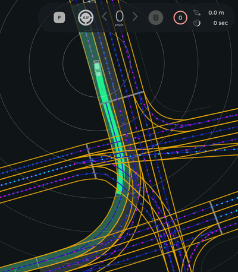
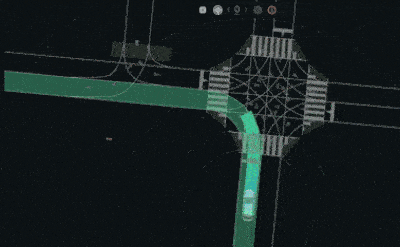
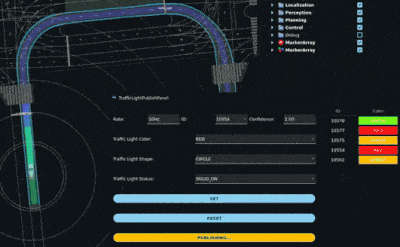

# Autoware Diffusion Planner

## Overview

The **Autoware Diffusion Planner** is a trajectory generation module for autonomous vehicles, designed to work within the [Autoware](https://autoware.org/) ecosystem. It leverages the [Diffusion Planner](https://github.com/ZhengYinan-AIR/Diffusion-Planner) model, as described in the paper ["Diffusion-Based Planning for Autonomous Driving with Flexible Guidance"](https://arxiv.org/abs/2501.15564) by Zheng et al. <!-- cSpell:ignore Zheng -->

This planner generates smooth, feasible, and safe trajectories by considering:

- Dynamic and static obstacles
- Vehicle kinematics
- User-defined constraints
- Lanelet2 map context
- Traffic signals and speed limits

It is implemented as a ROS 2 component node, making it easy to integrate into Autoware-based stacks. The node is aimed at working within the proposed [Autoware new planning framework](https://github.com/tier4/new_planning_framework).

---

## Features

- **Diffusion-based trajectory generation** for flexible and robust planning

  [](media/diffusion_planner.gif)

- **Integration with Lanelet2 maps** for lane-level context

  [](media/lanelet_map_integration.png)

- **Dynamic and static obstacle handling** using perception inputs

  [](media/diffusion_planner_reacts_to_bus.gif)

  [](media/reaction_to_other_agents.gif)

- **Traffic signal and speed limit awareness**

  [](media/traffic_light_support.gif)

- **ONNX Runtime** inference for fast neural network execution
- **ROS 2 publishers** for planned trajectories, predicted objects, and debug markers

---

## Parameters

{{ json_to_markdown("planning/autoware_diffusion_planner/schema/diffusion_planner.schema.json") }}

Parameters can be set via YAML (see `config/diffusion_planner.param.yaml`).

---

## Inputs

| Topic                     | Message Type                                        | Description              |
| ------------------------- | --------------------------------------------------- | ------------------------ |
| `~/input/odometry`        | nav_msgs/msg/Odometry                               | Ego vehicle odometry     |
| `~/input/acceleration`    | geometry_msgs/msg/AccelWithCovarianceStamped        | Ego acceleration         |
| `~/input/tracked_objects` | autoware_perception_msgs/msg/TrackedObjects         | Detected dynamic objects |
| `~/input/traffic_signals` | autoware_perception_msgs/msg/TrafficLightGroupArray | Traffic light states     |
| `~/input/vector_map`      | autoware_map_msgs/msg/LaneletMapBin                 | Lanelet2 map             |
| `~/input/route`           | autoware_planning_msgs/msg/LaneletRoute             | Route information        |

## Outputs

| Topic                        | Message Type                                              | Description                                |
| ---------------------------- | --------------------------------------------------------- | ------------------------------------------ |
| `~/output/trajectory`        | autoware_planning_msgs/msg/Trajectory                     | Planned trajectory for the ego vehicle     |
| `~/output/trajectories`      | autoware_internal_planning_msgs/msg/CandidateTrajectories | Multiple candidate trajectories            |
| `~/output/predicted_objects` | autoware_perception_msgs/msg/PredictedObjects             | Predicted future states of dynamic objects |
| `~/debug/lane_marker`        | visualization_msgs/msg/MarkerArray                        | Lane debug markers                         |
| `~/debug/route_marker`       | visualization_msgs/msg/MarkerArray                        | Route debug markers                        |

---

## Testing

Unit tests are provided and can be run with:

```bash
colcon test --packages-select autoware_diffusion_planner
colcon test-result --all
```

---

## ONNX Model and Versioning

The Diffusion Planner relies on an ONNX model for inference.  
To ensure compatibility between models and the ROS 2 node implementation, the model versioning scheme follows **major** and **minor** numbers:
The model version is defined either by the directory name provided to the node or within the `diffusion_planner.param.json` configuration file.

- **Major version**  
  Incremented when there are changes in the model **inputs/outputs or architecture**.  
  > ⚠️ Models with different major versions are **not compatible** with the current ROS node.  

- **Minor version**  
  Incremented when **only the weight files are updated**.  
  As long as the major version matches, the node remains compatible, and the new model can be used directly.

To download the latest model, simply run the provided setup script:  
[How to set up a development environment](https://autowarefoundation.github.io/autoware-documentation/main/installation/autoware/source-installation/#how-to-set-up-a-development-environment)


### Model Version History

| Version | Release Date | Notes                                                                                                                                                                                                                                          | ROS Node Compatibility |
| ------- | ------------ | ---------------------------------------------------------------------------------------------------------------------------------------------------------------------------------------------------------------------------------------------- | ---------------------- |
| **0.1** | 2025/07/05   | - First public release<br>- Route planning based on TIER IV real data                                                                                                                                                                          | NG                     |
| **1.0** | 2025/09/20   | - Route Termination learning<br>- Output turn-signal (indicator) <br>- Lane type integration in HD map for improved accuracy<br>- Added datasets:<br>&nbsp;&nbsp;- Synthetic Data: **4.0M points**<br>&nbsp;&nbsp;- Real Data: **1.5M points** | OK                     |

---

## Development & Contribution

- Follow the [Autoware coding guidelines](https://autowarefoundation.github.io/autoware-documentation/main/contributing/).
- Contributions, bug reports, and feature requests are welcome via GitHub issues and pull requests.

---

## References

- [Diffusion Planner (original repo)](https://github.com/ZhengYinan-AIR/Diffusion-Planner)
- [Diffusion planner (our fork of the previous repo, used to train the model)](https://github.com/tier4/Diffusion-Planner)
- ["Diffusion-Based Planning for Autonomous Driving with Flexible Guidance"](https://arxiv.org/abs/2309.00615)

---

## License

This package is released under the Apache 2.0 License.
