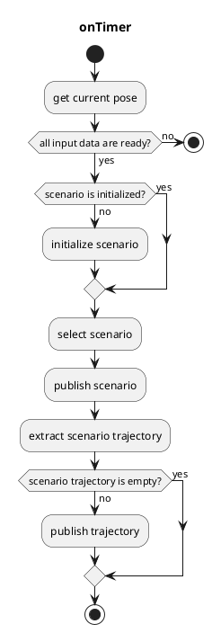
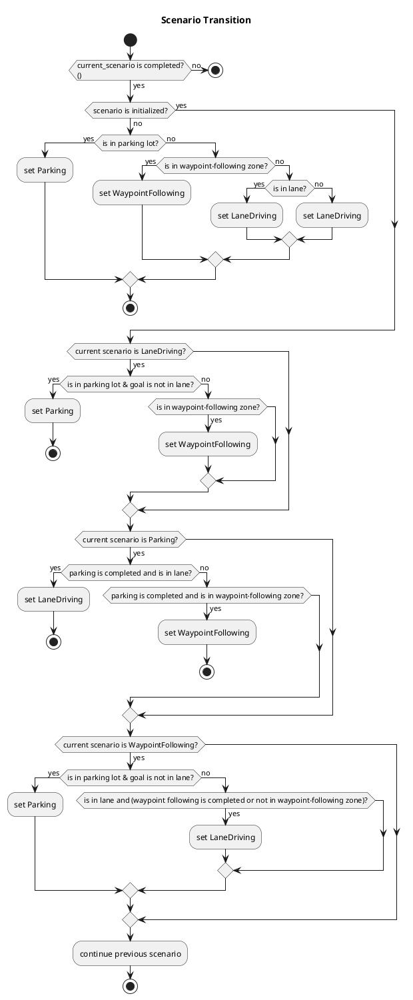

# autoware_extra_scenario_selector

## extra_scenario_selector_node

`extra_scenario_selector_node` is a ROS 2 node that switches trajectories among **LaneDriving / Parking / WaypointFollowing** scenarios.

### Input topics

| Name                                   | Type                                               | Description                                                        |
|----------------------------------------|----------------------------------------------------|--------------------------------------------------------------------|
| `~input/lane_driving/trajectory`       | `autoware_planning_msgs::Trajectory`               | Trajectory for the LaneDriving scenario                            |
| `~input/parking/trajectory`            | `autoware_planning_msgs::Trajectory`               | Trajectory for the Parking scenario                                |
| `~input/waypoint_following/trajectory` | `autoware_planning_msgs::Trajectory`               | Trajectory for the WaypointFollowing scenario                      |
| `~input/lanelet_map`                   | `autoware_map_msgs::msg::LaneletMapBin`            | Lanelet2 map                                                        |
| `~input/route`                         | `autoware_planning_msgs::LaneletRoute`             | Route and goal pose                                                 |
| `~input/odometry`                      | `nav_msgs::Odometry`                               | Used to check whether the vehicle is stopped                       |
| `~input/operation_mode_state`          | `autoware_adapi_v1_msgs::msg::OperationModeState`  | Used to check if autonomous driving mode and control are enabled   |
| `is_parking_completed`                 | `bool` (rosparam)                                  | Whether all split trajectories of the Parking scenario are complete |
| `is_waypoint_following_completed`      | `bool` (rosparam)                                  | Whether WaypointFollowing scenario is completed                    |

### Output topics

| Name                 | Type                                         | Description                                              |
|----------------------|----------------------------------------------|----------------------------------------------------------|
| `~output/scenario`   | `autoware_internal_planning_msgs::Scenario`  | Current scenario and the list of active scenarios        |
| `~output/trajectory` | `autoware_planning_msgs::Trajectory`         | The trajectory to be followed by the vehicle             |

### Output TFs

None

### How to launch

1. Write your remapping configuration in `extra_scenario_selector.launch` or pass the arguments when launching.
2. `roslaunch autoware_extra_scenario_selector extra_scenario_selector.launch`
   - If you would like to use only a single scenario, `roslaunch autoware_extra_scenario_selector dummy_extra_scenario_selector_{scenario_name}.launch`

### Parameters

{{ json_to_markdown("planning/autoware_scenario_selector/schema/scenario_selector.schema.json") }}

### Flowchart

