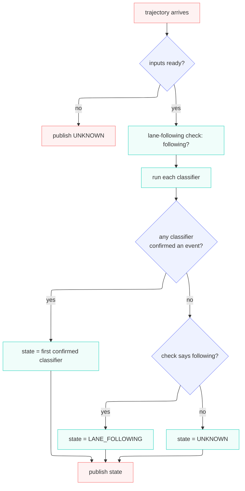

# autoware_lane_event_classifier

Classifies lane events — lane change, intentional lane crossing — for event logging.

---

## What this node does

Every cycle, the node publishes **one** state describing what the ego is doing with respect to its
lane.

The state is published on `/planning/driving_factor` as a `DrivingState`. A downstream event recorder
stores every frame, so the log can later show when the vehicle changed lanes, aborted, or drifted,
and for how long.

The node does not control the vehicle; it only observes and labels it.

---

## Inputs and output

**Trigger.** The node runs once per planned trajectory message. `/planning/trajectory` is the clock.

### Subscriptions

| Topic                      | Type                   | Role                                                                                                           |
| -------------------------- | ---------------------- | -------------------------------------------------------------------------------------------------------------- |
| `/planning/trajectory`     | `Trajectory`           | Per-cycle trigger; also the predictive signal for lane change.                                                 |
| `/map/vector_map`          | `LaneletMapBin`        | The lanelet map (latched, taken once).                                                                         |
| _(polled)_ odometry        | `Odometry`             | Ego pose; its stamp drives all timers (determinism).                                                           |
| _(polled)_ route           | `LaneletRoute`         | The mission and its preferred primitives.                                                                      |
| _(polled)_ objects         | `PredictedObjects`     | Perceived objects (used by crossing logic).                                                                    |
| _(polled)_ turn indicators | `TurnIndicatorsReport` | Optional hint for the lane-change confidence booster. Never a precondition — if missing, the cycle still runs. |

### Publication

| Topic                      | Type                                         |
| -------------------------- | -------------------------------------------- |
| `/planning/driving_factor` | `DrivingFactor` (carries one `DrivingState`) |

### Output states (`DrivingState`)

| State                                | Value | Meaning                                                                             |
| ------------------------------------ | ----- | ----------------------------------------------------------------------------------- |
| `UNKNOWN`                            | 0     | Inputs not ready, **or** the ego left its lane but no classifier claimed the event. |
| `LANE_FOLLOWING`                     | 1     | The ego is still in its lane and no event is active.                                |
| `LANE_CHANGING`                      | 2     | The lane-change classifier confirmed a change in progress.                          |
| `ABORTING_LANE_CHANGE`               | 3     | A committed lane change is reversing back to the reference lane.                    |
| `INTENTIONAL_LANE_CROSSING`          | 4     | The intentional-crossing classifier confirmed a crossing.                           |
| `ABORTING_INTENTIONAL_LANE_CROSSING` | 5     | A committed intentional crossing is reversing.                                      |

---

## How the node decides the state (per cycle)

> **The lane-following check.** `LaneFollowingChecker` answers one yes/no question: _is the ego
> still inside the lane it is supposed to be following?_ Its result is
> the **default label**: when no classifier claims an event, the check passing gives `LANE_FOLLOWING`,
> and the check failing (the ego left its lane, unexplained) gives `UNKNOWN`. It runs alongside the
> classifiers, not before them — they run every cycle regardless.

The order of resolution:

1. **Every enabled classifier runs every cycle.** A classifier reporting `LANE_FOLLOWING` or
   `UNKNOWN` counts as "no event".
2. **First confirmed classifier wins.** Classifiers are checked in a fixed priority order
   (lane change, then intentional crossing).
3. **No event → fall back to the lane-following check.** If the check says following, the state is
   `LANE_FOLLOWING`. If the check says the ego departed but no classifier explained it, the state is
   `UNKNOWN`.

---

## Architecture (who owns what)

The classifiers are **not** loaded via pluginlib. The node owns a `std::vector` of concrete
`LaneEventClassifierBase` implementations, built once in `build_classifiers()` and iterated each
cycle. Adding a classifier is: implement the interface, then register it in `build_classifiers()`.

| Component                       | Responsibility                                                                                                         |
| ------------------------------- | ---------------------------------------------------------------------------------------------------------------------- |
| `LaneEventClassifierNode`       | Owns the subscriptions/publisher, runs the per-cycle sequence above, and arbitrates the winning state.                 |
| `LaneEventClassifierBase`       | The classifier interface: `update()`, `get_state()`, `is_enabled()`, `name()` (+ optional `debug_reason()` / markers). |
| `LaneFollowingChecker`          | The lane-following check. Node-owned, separate from the classifiers.                                                   |
| `LaneChangeClassifier`          | The lane-change recogniser (a `LaneEventClassifierBase`).                                                              |
| `IntentionalCrossingClassifier` | The intentional-crossing recogniser (a `LaneEventClassifierBase`).                                                     |

---

## What's implemented now

| Piece                              | Status                                                           |
| ---------------------------------- | ---------------------------------------------------------------- |
| Node I/O (subscriptions/publisher) | ✅ implemented                                                   |
| Classifier loading + aggregation   | ✅ implemented                                                   |
| `LaneFollowingChecker`             | 🚧 stub — always reports following                               |
| `LaneChangeClassifier`             | 🚧 stub — reports no event                                       |
| `IntentionalCrossingClassifier`    | 🚧 stub — reports no event                                       |
| `LaneTracker` (map/reference lane) | ⏭️ TBA — the map is subscribed and stashed, but not yet consumed |

---

## Parameters

Schema: [`schema/lane_event_classifier.schema.yaml`](schema/lane_event_classifier.schema.yaml).
Defaults: [`param/lane_event_classifier.param.yaml`](param/lane_event_classifier.param.yaml).

| Name                              | Meaning                                                                                                                                                                     |
| --------------------------------- | --------------------------------------------------------------------------------------------------------------------------------------------------------------------------- |
| `reposition_jump_margin_m`        | Localization-noise margin added to the speed-explained step (`speed · dt`); a per-cycle ego step beyond that is treated as a reposition jump and resets the tracking state. |
| `lane_departure_reset_distance_m` | While the reference lane is held, distance from the ego to that lane above which the tracking state is reset (countermeasure for a manual takeover).                        |

Each classifier gains its own enable flag and parameters when its logic lands.

---

## Design notes

- **Determinism.** All timers use the message timestamp (`odometry.header.stamp`), never wall-clock
  time. Replaying the same rosbag gives the same output.
- **The lane-following check and the classifiers are independent.** The check is a stateless "am I in
  my lane?" test; the classifiers are stateful event recognisers. The node combines them; neither
  drives the other.
