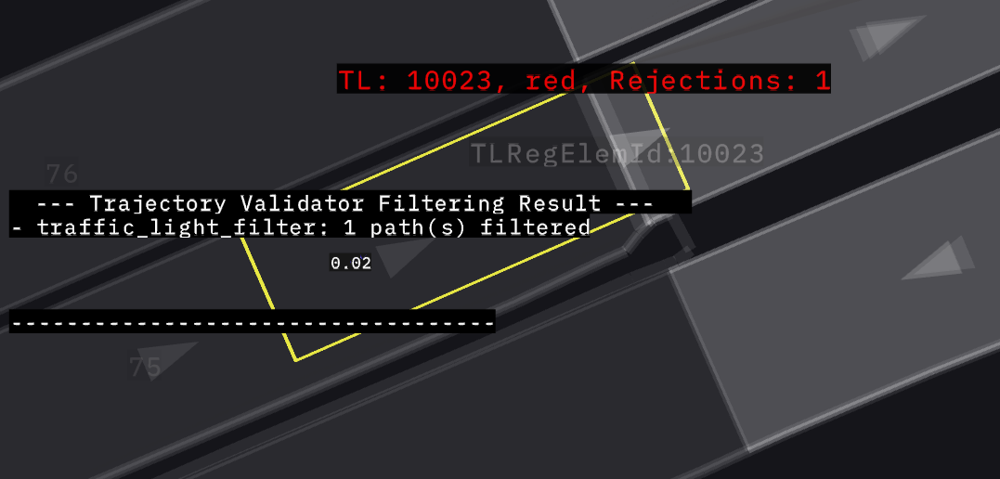

# Traffic Light Filter

## Purpose/Role

This filter rejects trajectories if they are found to run through a red or amber traffic light. It ensures that the planned motion adheres to traffic signals by validating that the vehicle does not cross stop lines when the signal is prohibitive, while accounting for the "dilemma zone" during amber lights and allowing for a configurable stopping margin.

This filter uses the TrafficLightComplianceChecker to check for violations. For details of the compliance checker logic refer to
[Compliance Checker Documentation](../../../common/autoware_traffic_light_compliance_checker/README.md).

The TrafficLightComplianceChecker will check for violations and return the results. The traffic light filter will then scan the provided results for any red/amber light crossing. If the trajectory is crossing a red/amber light then the trajectory is rejected.

When a crossing violation is detected, the trajectory is nevertheless allowed if both of the following conditions are met:

- The distance from the current ego vehicle front point to the stop line is strictly less than `traffic_light.allow_if_cannot_stop_distance`.
- The same distance is strictly less than the current stopping distance minus `traffic_light.stop_overshoot_margin`.

The current stopping distance is calculated from the ego velocity and acceleration using `traffic_light.checked_trajectory_length.deceleration_limit`, `traffic_light.checked_trajectory_length.jerk_limit`, and `traffic_light.delay_response_time`. Setting `traffic_light.allow_if_cannot_stop_distance` to `0.0` disables this allowance.

## Algorithm Overview

The following diagram shows the overall logic flow of the TrafficLightFilter:

```plantuml
@startuml
skinparam defaultTextAlignment center
skinparam backgroundColor #WHITE
start
if (Is Invalid Input?) then (yes)
:return unexpected;<<#LightYellow>>
stop
else (no)
endif
if (Is Compliance Checker Initialized?) then (no)
:return unexpected;<<#LightYellow>>
stop
else (yes)
endif
:Constuct Compliance Checker Input Struct;<<#LightBlue>>
:Run Compliance Checker;<<#LightBlue>>
if (Is Check Results Available?) then (no)
:Return Unexpected;<<#LightYellow>>
stop
else (yes)
endif
:Check Results;<<#LightBlue>>
:Set Debug Data & Metrics Report;<<#LightBlue>>
if (Is Found Violation?) then (yes)
:Set to NOT Feasible;<<#LightPink>>
else (no)
:Set to Feasible;<<#LightGreen>>
endif
:Return Validation Result;<<#LightBlue>>
stop
@enduml
```

## Interface

### Context

The filter utilizes the following data from the `FilterContext`:

- **Lanelet Map**: Used to find regulatory elements (traffic lights) and their associated stop lines.
- **Traffic Light Signals**: Provides the current state (color) of traffic light groups.
- **Route**: Used to map traffic light signals to lanelets and filter those that are relevant to the vehicle's path.
- **Vehicle Info**: Used to account for the vehicle's dimensions (longitudinal offset) when checking for stop line intersections.
- **Odometry**: Provides the current velocity to determine if ego is stopped and to calculate stopping distances.

### Parameters

| Parameter name                                               | Type   | Default | Description                                                                                                       |
| ------------------------------------------------------------ | ------ | ------- | ----------------------------------------------------------------------------------------------------------------- |
| `traffic_light.deceleration_limit`                           | double | 2.8     | [m/s²] Deceleration limit used to estimate the minimum stopping distance at an amber light.                       |
| `traffic_light.jerk_limit`                                   | double | 5.0     | [m/s³] Jerk limit used to estimate the minimum stopping distance at an amber light.                               |
| `traffic_light.delay_response_time`                          | double | 0.5     | [s] Delay response time added to the stopping distance calculation.                                               |
| `traffic_light.crossing_time_limit`                          | double | 2.75    | [s] Maximum time allowed for the ego vehicle to cross the stop line after an amber light appears.                 |
| `traffic_light.treat_amber_light_as_red_light`               | bool   | true    | When true, amber lights are treated identically to red lights (rejection on intersection regardless of distance). |
| `traffic_light.treat_unknown_light_as_red_light`             | bool   | false   | When true, unknown lights are treated identically to red lights (rejection on intersection).                      |
| `traffic_light.stop_overshoot_margin`                        | double | 0.5     | [m] Maximum distance between the stop line and the trajectory stop point to consider the trajectory feasible.     |
| `traffic_light.allow_if_cannot_stop_distance`                | double | 0.0     | [m] Allow crossing when the ego front is within this distance and ego cannot stop before the stop line.           |
| `traffic_light.stable_duration_threshold_red`                | double | 0.0     | [s] Minimum duration a RED light must be seen before it is considered active (only when ego is moving).           |
| `traffic_light.stable_duration_threshold_amber`              | double | 0.0     | [s] Minimum duration an AMBER light must be seen before it is considered active (only when ego is moving).        |
| `traffic_light.stable_duration_threshold_unknown`            | double | 0.0     | [s] Minimum duration an UNKNOWN light must be seen before it is considered active (only when ego is moving).      |
| `traffic_light.amber_rejection_hysteresis_duration`          | double | 0.0     | [s] Duration to persist an amber rejection state to prevent "flipping" due to minor velocity/distance changes.    |
| `traffic_light.ego_stopped_velocity_threshold`               | double | 0.01    | [m/s] Velocity threshold below which stability and hysteresis filters are bypassed.                               |
| `traffic_light.checked_trajectory_length.deceleration_limit` | double | 2.0     | [m/s²] Deceleration limit used to calculate the maximum trajectory length to check for traffic lights.            |
| `traffic_light.checked_trajectory_length.jerk_limit`         | double | 4.0     | [m/s³] Jerk limit used to calculate the maximum trajectory length to check for traffic lights.                    |

## Logging and Visualization

The `TrafficLightFilter` provides debug markers to visualize which traffic lights caused trajectory rejections. These markers are aggregated across all candidate trajectories evaluated within a single processing frame.

### Debug Markers

For each traffic light with a relevant stop-line crossing, a `TEXT_VIEW_FACING` marker is generated at the position of the traffic light's stop line.

The marker text contains:

- **TL ID**: The unique identifier of the traffic light (regulatory element).
- **Signal**: The current signal state as interpreted by the filter (e.g., `red`, `amber`, `amber as red`, `unknown as amber`).
- **Rejections**: The total number of trajectories that were rejected due to this specific traffic light in the current frame.

When a candidate trajectory intersects a relevant stop line, the text also shows the signed distance from the ego front to the stop line, the configured allow-distance limit, the calculated ego stopping distance, and whether the crossing was allowed or enforced. The distance is negative after the ego front passes the stop line.

The dilemma-zone visualization also includes:

- A cyan sphere at the calculated ego front pose.
- A magenta line across the lane at `allow_if_cannot_stop_distance` before the stop line.
- A translucent stopping wall at `ego_stopping_distance - stop_overshoot_margin` from the ego front. The wall is red when ego can stop before the stop line and green when the projected stopping point is beyond it.


