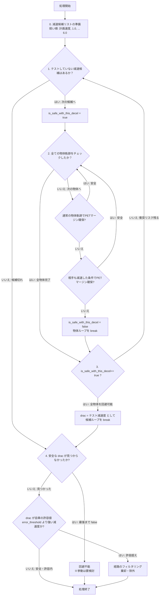
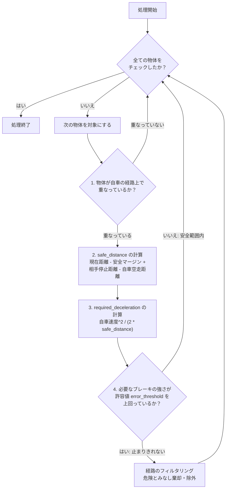

# Collision Check Filter

## メトリクス一覧

- DRAC+PET 自車、及び他車の双方が、適切な減速を行うことにより（PETマージンを確保して）衝突を回避できるかを判定
- RSS 自車の通過領域にいる物体が急停止した際に、衝突前に停止できるかを判定

## 軌跡生成

物体や自身が、”どの時刻”に”どのような位置と向き”にいるかを予測し、その結果を衝突判定に用いています。

”経路”と”軌跡”はそれぞれpathとtrajectoryに対応する用語として、使い分けています。

| trajectory名       | pathの生成/読み取り                                                                                                                                                                                                                                                                                                                                | 速度の時間遷移の生成/読み取り                                                            |
| ------------------ | -------------------------------------------------------------------------------------------------------------------------------------------------------------------------------------------------------------------------------------------------------------------------------------------------------------------------------------------------- | ---------------------------------------------------------------------------------------- |
| map_based          | map_basaed_predictionという外部ノードで生成された情報を読み取っています <br> 自動車など：無理なく追従可能な全ての車線に対して、車線に追従するような経路が生成されます <br> 歩行者：現在の進行方向に向かう経路、もしくは横断歩道に吸い付くような経路が生成されます <br> 複数出力される候補経路のうち、尤もらしい1本を選択して衝突判定を行っています | 等速度運動（4/30時点では無し）、もしくは一定減速度運動での速度軌跡を内部で生成しています |
| constant_curvature | 物体が速度と角速度を維持する、すなわち一定曲率の経路を生成します                                                                                                                                                                                                                                                                                   | 等速度運動（4/30時点では無し）、もしくは一定減速度運動での速度軌跡を内部で生成しています |

## DRAC+PET 自車、及び他車の双方が、適切な減速を行うことにより（PETマージンを確保して）衝突を回避できるかを判定

異なる方向に進行する物体も含めて、文字通り”衝突を避けるためには、自車がどれだけ減速する必要があるか”を、PET（通過時間差）を用いて段階的に探索・特定する処理です。
「PETマージンを加味して衝突を回避できるような減速度」を求めているため、「DRAC+PET」という命名を行っています。
なお、略語としてのDRACは、もっぱら1次元での相対距離xと相対速度vから、衝突を回避するための減速度をv^2/(2x)として計算するものであり、ここでの用法とは異なります。

### 処理手順（要約）

- **0. 準備：** 評価対象となる減速度のリスト（計画速度、1.0～6.0 m/s²など）を、値の小さい（弱いブレーキ）順に用意する。
- **1. 候補の選択：** リストから「テスト減速度」を1つ選び、全物体の軌跡に対して、安全に避けられるかのチェックを行う。
- **2. 衝突リスクの確認：** 各物体の各予測経路に対し、「物体が等速で動いた場合」または「物体も自車と同等に減速した場合」のいずれかで十分なPETマージンが確保できるか判定する。
  - どちらも危険な場合はその減速度では衝突を回避できないとし、次の強い減速度候補へ進む。
  - 現状は自車を特別扱いしないアルゴリズムを組んでいるが、実験結果からここの見直しが必要なことが見えている。

- **3. DRACの決定：** 全ての物体に対して安全が確認できた最初の（最も緩い）テスト減速度を「DRAC」として確定し、探索ループを終了する。
- **4. 最終判定と対処：**
  - **回避不能：** 用意した全ての減速度を試しても安全が確保できない場合。
  - **経路の棄却：** 確定したDRACが、自車の許容する減速度（閾値）を上回っている場合は危険とみなし、その経路を棄却・除外する。場合によっては、-6.0 m/s² の緊急停止を行う。

### パラメータリスト

| パラメータ名                       | 意味                                               | 設定値                        | 根拠                                                                                            |
| ---------------------------------- | -------------------------------------------------- | ----------------------------- | ----------------------------------------------------------------------------------------------- |
| `enable_assessment`                | 評価計算を行うかを選択                             | true                          |                                                                                                 |
| `assessment_trajectories`          | どの経路予測手法を用いるかを選択 複数選択可能      | map_based, constant_curvature | とりあえず全部                                                                                  |
| `ego_total_braking_delay`          | safety_filter以後の遅延時間 認識側の遅延は含まない | 0.4 [s]                       | 以下の合計より、設定 *autoware遅延0.1s*車両遅延 0.2s \*ジャークによる遅延 0.1s （0.4/20/2より） |
| `ego_first_passing_time_gap`       | 自身が先に通過する場合の衝突マージン               | 1.0（0.6に変更予定） [s]      | 根拠なし                                                                                        |
| `object_first_passing_time_gap`    | 物体が先に通過する場合の衝突マージン               | 1.0（0.3に変更予定） [s]      | 根拠なし                                                                                        |
| `warn_threshold.ego_acceleration`  | 開発用                                             | -2.0                          | 根拠なし                                                                                        |
| `error_threshold.ego_acceleration` | 経路をフィルタリングするかを判定する減速度閾値     | -4.0 [m/s²]                   | J6の最大減速度 -6.0より、いくらかのマージンをとった値                                           |

### 疑似コード

```text
// DRAC+PET は、「衝突を避けるには自車/他車にどれだけの減速度が必要か」を
// PET ベースの衝突判定を使って段階的に探索する

// 0. 評価に使う準備
// DRAC+PET: 「衝突を避けるための必要減速度（DRAC）」を、PETを用いて段階的に探索する
// （※評価時間は、自車の計画軌跡の終端時刻までとする）

// 0. 評価する減速度の候補を準備
減速候補リスト = [計画通りの速度, 1.0, 2.0, 3.0, 4.0, 5.0, 6.0] // 単位: m/s^2

// 1. 減速度の小さい（弱い）候補から順に評価していく
for (テスト減速度 in 減速候補リスト) {

    is_safe_with_this_decel = true // 一旦、「この減速度で安全に避けられる」と仮定する

    // 2. この「テスト減速度」で、全ての物体との衝突リスクが消えるかを確認する
    for (各物体軌跡 in 全ての物体の予測経路) {

        // 物体が「予測どおり動いた場合」または「自車と同じだけ減速してくれた場合」の
        // どちらかで十分なPETマージン（通過時間差）が確保できれば、この物体に対しては安全
        if (通常の物体軌跡で十分なPETマージンが確保できる) { continue }
        if (相手も減速した条件で十分なPETマージンが確保できる) { continue }

        // どちらの条件でも衝突リスクが残るなら、この「テスト減速度」では回避に足りない
        is_safe_with_this_decel = false
        break // この減速度での確認を打ち切り、次の（より強い）減速候補のテストへ進む
    }

    // 3. 全ての物体との衝突候補が消えた場合、それをDRACとして採用
    if (is_safe_with_this_decel == true) {
        drac = テスト減速度
        break // 最小の必要減速度（DRAC）が見つかったので、探索ループを終了する
    }
}

// 4. 危険判定と対処
if (最後まで安全な drac が見つからなかった) {
    回避不能 // ※この場合の挙動は要検討
}
else if (drac が $error_threshold.ego_acceleration よりも強い減速度) {
    // 必要な減速度が見つかったが、自車の許容値（閾値）を上回っている場合
    経路のフィルタリング // この経路は危険とみなし、棄却・除外する
}
```

### フローチャート



## RSS 自車の通過領域にいる物体が急停止した際に、衝突前に停止できるかを判定

### 処理手順（要約）

自車の進路上にいる物体が急停止した際、衝突前に安全に停止できるかを判定する処理です。

- **1. 進路のチェック：** 周囲の全物体を確認し、自車の将来の経路（通過領域）に重ならない物体は安全としてスキップする。
- **2. 実質的な距離（Safe Distance）の計算：** 現在の距離に「相手が停止するまでに進む距離」を足し、そこから「自車の空走距離」と「安全マージン」を引くことで、ブレーキに使える距離を算出する。
- **3. 必要減速度の計算：** 現在の自車速度と算出した「実質的な距離」から、安全に止まるために必要なブレーキの強さ（減速度）を算出する。
- **4. 危険判定と対処：** 計算された必要な減速度が自車の許容値（閾値）を上回っている場合は、物理的に止まりきれないと判断し、その経路を棄却・除外する。場合によっては、-6.0 m/s² の緊急停止を行う。

### パラメータリスト

| パラメータ名                       | 意味                                                              | 設定値      | 根拠                                                                                            |
| ---------------------------------- | ----------------------------------------------------------------- | ----------- | ----------------------------------------------------------------------------------------------- |
| `enable_assessment`                | 評価計算を行うかを選択                                            | true        |                                                                                                 |
| `stop_distance_margin`             |                                                                   | 2.0 [m]     | 1.0~3.0ぐらいの想定                                                                             |
| `ego_total_braking_delay`          | safety_filter以後の遅延時間 [s] 認識側の遅延は含まない （要修正） | 0.4         | 以下の合計より、設定 *autoware遅延0.1s*車両遅延 0.2s \*ジャークによる遅延 0.1s （0.4/20/2より） |
| `object_assumed_acceleration`      | 進路上の物体が発揮しうると想定する減速度                          | -4.0        | error_threshold.ego_accelerationと同じ値より                                                    |
| `error_threshold.ego_acceleration` | 経路をフィルタリングするかを判定する減速度閾値                    | -4.0 [m/s²] | J6の最大減速度 -6.0より、いくらかのマージンをとった値                                           |

object_assumed_accelerationにerror_threshold.ego_accelerationよりも強い減速度を設定すると、停止位置よりも手前での衝突リスクが考慮できないことに注意

### 疑似コード

```text
// 周囲の全ての物体に対して、衝突危険性をチェックする
for (各物体 in 全ての物体) {

    // 1. 進路のチェック
    if (物体が自車の経路上で重ならない) {
        continue // 危険がないため、次の物体のチェックへ進む
    }

    // 2. ブレーキに使える距離の計算
    // （※相手の速度や、システムの遅れ時間などを加味して見積もる）
    現在の距離 = 自車から物体までの間隔
    相手の停止距離 = 相手が急ブレーキをかけて止まるまでに進む距離
                    (物体速度^2 / (2 * object_assumed_acceleration))
    自車の空走距離 = 自車のブレーキが効き始めるまでに進んでしまう距離
                    (自車速度 * $ego_total_braking_delay)
    安全マージン = 停止時に最低限あけておくべき余裕距離
                  ($stop_distance_margin)

    // 実際にブレーキをかけるために使える「実質的な距離」
    safe_distance =
        現在の距離
        - 安全マージン
        + 相手の停止距離
        - 自車の空走距離

    // 3. 必要なブレーキの強さ（減速度）の計算
    required_deceleration = (自車速度^2) / (2 * safe_distance)

    // 4. 危険判定と対処
    if (required_deceleration > error_threshold.ego_acceleration) {
        // 必要なブレーキの強さが自車の許容値（閾値）を上回っている場合、安全に止まりきれない
        経路のフィルタリング // この経路は危険とみなし、棄却・除外する
    }
}
```

### フローチャート


