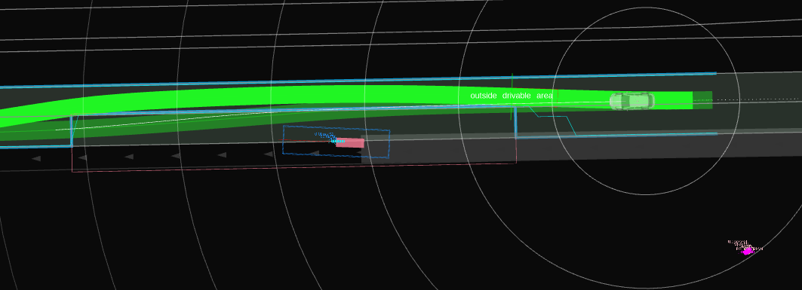
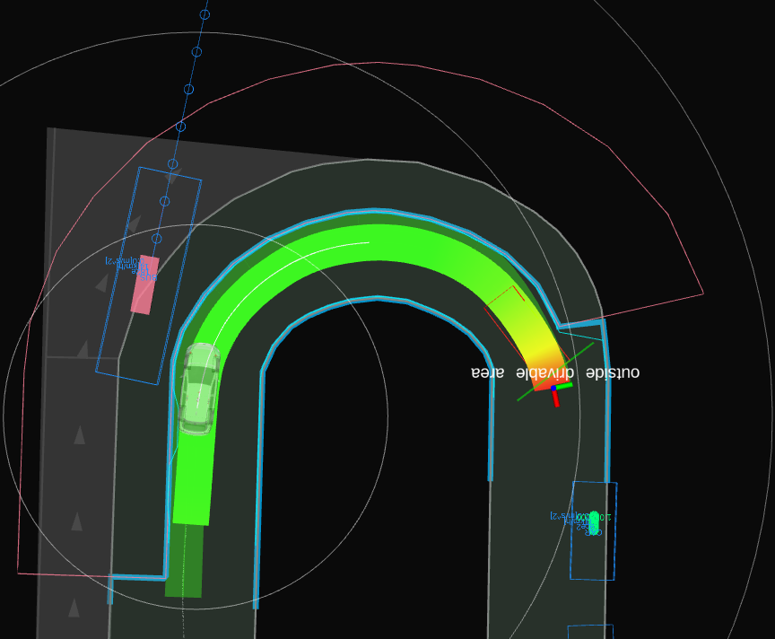
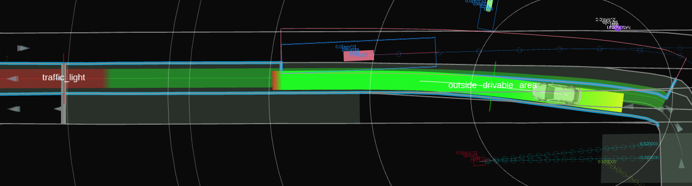
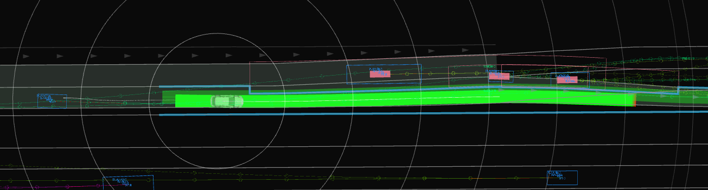

# Avoidance module for dynamic objects

This module is under development.

## Purpose / Role

This module provides avoidance functions for vehicles, pedestrians, and obstacles in the vicinity of the ego's path, in combination with the [autoware_path_optimizer](https://autowarefoundation.github.io/autoware_universe/main/planning/autoware_path_optimizer/).
The Dynamic Avoidance module adjusts the drivable area based on the position and velocity of the target to be avoided.
The Obstacle Avoidance module modifies the path so that it stays within the received drivable area.

Avoidance of static obstacles is handled by the [Static Avoidance module](https://autowarefoundation.github.io/autoware_universe/main/planning/behavior_path_planner/autoware_behavior_path_static_obstacle_avoidance_module/), but its role is different.
The Static Avoidance module generates paths that avoid static obstacles by changing lanes. It does not handle moving objects.
The table below shows which modules are used for each case:

|                             |                           Avoid within ego lane                            | Avoid by deviating from lane |
| :-------------------------- | :------------------------------------------------------------------------: | :--------------------------: |
| Static (not-moving) objects | Avoidance Module   Dynamic Avoidance Module + Obstacle Avoidance Module |   Static Avoidance Module    |
| Moving objects              |            Dynamic Avoidance Module + Obstacle Avoidance Module            |  (Module under development)  |

## Inner workings/Algorithms

The internal algorithms are divided into two parts: the first decides whether to avoid the obstacle, and the second trims the drivable area to avoid the corresponding obstacle.

### Selection of obstacles to avoid

To decide whether to avoid an object, the module uses both the predicted path and the state (pose and twist) of each object.
It also considers the types of objects the user has configured the module to avoid.
Using this information, the module decides to _avoid_ objects that _obstruct the ego's passage_ and _can be avoided_.

_Obstruct the ego's passage_ denotes an object that is predicted to collide with the ego vehicle within a few seconds.
_Can be avoided_ means the object can be avoided without risk to the passengers or the other vehicles.
The module assesses whether the obstacle can be avoided while satisfying the constraints of lateral acceleration and lateral jerk.
For example, the module would not attempt to avoid an object that is too close or is moving too quickly in a lateral direction.

### Adjustment of drivable area based on selected vehicles

The module trims the drivable area around obstacles selected for avoidance.
To determine the shape of the trimmed polygons, it primarily uses the poses of the obstacles, assuming they move roughly parallel to the ego vehicle’s path rather than following their predicted paths.
This design choice reflects the limitations of object path prediction, which is currently not accurate enough to use path modifications.
The resulting drivable area includes rectangular cutouts along the ego path, allowing the computation to be scalar rather than planar.

#### Determination of lateral dimension

The lateral dimensions of the polygon are calculated as follows.
The polygon's width to extract from the drivable area is the obstacle width and `drivable_area_generation.lat_offset_from_obstacle`.
We can limit the lateral shift length by `drivable_area_generation.max_lat_offset_to_avoid`.

#### Determination of longitudinal dimension

Extracting the same directional and opposite directional obstacles from the drivable area will work as follows, considering TTC (time to collision).

Regarding the same directional obstacles, obstacles whose TTC is negative will be ignored (e.g., The obstacle is in front of the ego, and the obstacle's velocity is larger than the ego's velocity.).

Same directional obstacles (Parameter names may differ from implementation)

Opposite directional obstacles (Parameter names may differ from implementation)

### Adjustment of drivable area based on selected pedestrians

This section explains how the module generates the drivable area when avoiding pedestrians.
Pedestrians are treated as having the right of way over the ego vehicle, while still maintaining a minimum safety margin for the ego vehicle.
The module excludes from the drivable area a margin around each pedestrian, based on the pedestrian’s predicted path, the confidence of that prediction, and a defined time interval. This excluded area includes a safety margin, as shown in the following figure.

<figure>
    
    <figcaption> Restriction areas are generated from each pedestrian's predicted paths</figcaption>
</figure>

In addition to polygons generated for obstacles, the module creates an extra polygon to ensure the ego vehicle's stability. This polygon helps prevent sudden steering or abrupt changes to the planned path.
This is similar to avoidance behavior for other vehicles and takes precedence over keeping a safe distance from the object to be avoided.
As a result, as shown in the figure below, the polygons around objects are reduced by the ego stability polygon, and only the remaining area is excluded from the ego vehicle’s drivable area.

<figure>
    
    <figcaption> Ego's minimum requirements are prioritized against object margin</figcaption>
</figure>

## Examples

<figure>
    
    <figcaption>Avoidance involving a bus at a bus stop</figcaption>
</figure>

<figure>  
    
    <figcaption>Avoidance on a curve </figcaption>
</figure>

<figure>
    
    <figcaption>Avoidance involving an oncoming vehicle</figcaption>
</figure>

<figure>
    
    <figcaption>Avoidance involving multiple vehicles</figcaption>
</figure>

## Future work

Currently, the path shift length is limited to 0.5 meters or less, as defined by `drivable_area_generation.max_lat_offset_to_avoid`.
This limitation exists due to the module’s current lack of integration with other modules and the structure of the planning component.
As a result, this module can only handle situations that require a small avoidance width.
This is currently the most significant limitation of the module.
In the future, it will also be important for the module to support extensions of the drivable area as needed.

## Parameters

Under development

| Name                                                                  | Unit  | Type   | Description                                                | Default value |
| :-------------------------------------------------------------------- | :---- | :----- | :--------------------------------------------------------- | :------------ |
| target_object.car                                                     | [-]   | bool   | The flag whether to avoid cars or not                      | true          |
| target_object.truck                                                   | [-]   | bool   | The flag whether to avoid trucks or not                    | true          |
| ...                                                                   | [-]   | bool   | ...                                                        | ...           |
| target_object.min_obstacle_vel                                        | [m/s] | double | Minimum obstacle velocity to avoid                         | 1.0           |
| drivable_area_generation.lat_offset_from_obstacle                     | [m]   | double | Lateral offset to avoid from obstacles                     | 0.8           |
| drivable_area_generation.max_lat_offset_to_avoid                      | [m]   | double | Maximum lateral offset to avoid                            | 0.5           |
| drivable_area_generation.overtaking_object.max_time_to_collision      | [s]   | double | Maximum value when calculating time to collision           | 3.0           |
| drivable_area_generation.overtaking_object.start_duration_to_avoid    | [s]   | double | Duration to consider avoidance before passing by obstacles | 4.0           |
| drivable_area_generation.overtaking_object.end_duration_to_avoid      | [s]   | double | Duration to consider avoidance after passing by obstacles  | 5.0           |
| drivable_area_generation.overtaking_object.duration_to_hold_avoidance | [s]   | double | Duration to hold avoidance after passing by obstacles      | 3.0           |
| drivable_area_generation.oncoming_object.max_time_to_collision        | [s]   | double | Maximum value when calculating time to collision           | 3.0           |
| drivable_area_generation.oncoming_object.start_duration_to_avoid      | [s]   | double | Duration to consider avoidance before passing by obstacles | 9.0           |
| drivable_area_generation.oncoming_object.end_duration_to_avoid        | [s]   | double | Duration to consider avoidance after passing by obstacles  | 0.0           |
