# Out of Lane

## Role

The `run_out` module adds deceleration and stop points to the ego trajectory in order to prevent collisions with objects that are moving towards the ego vehicle path.

## Activation

This module is activated if the launch parameter `launch_mvp_run_out_module` is set to true.

## Inner-workings / Algorithms

This module calculates the times when the ego vehicle and the objects are predicted to overlaps each other's trajectories.
These times are then used to decide whether to stop before the overlap or not.

The algorithm assumes the input ego trajectory contains accurate `time_from_start`
values in order to calculate accurate time to collisions with the predicted objects.

Next we explain the inner-workings of the module in more details.

### 1. Ego trajectory footprints

In this first step, the ego footprint is projected at each trajectory point and its size is modified based on the `ego.extra_..._offset` parameters.

The length of the trajectory used for generating the footprints is limited by the `max_arc_length` parameter.

### 2. Other lanelets

In the second step, we calculate the lanelets where collisions should be avoided.
We consider all lanelets around the ego vehicle that are not crossed by the trajectory linestring (sequence of trajectory points) or their preceding lanelets.

In the debug visualization, these other lanelets are shown as blue polygons.

### 3. Out of lane areas

Next, for each trajectory point, we create the corresponding out of lane areas by intersection the other lanelets (from step 2) with the trajectory point footprint (from step 1).
Each area is associated with the lanelets overlapped by the area and with the corresponding ego trajectory point.

In the debug visualization, the out of lane area polygon is connected to the corresponding trajectory point by a line.

### 4. Predicted objects filtering

We filter objects and their predicted paths with the following conditions:

- ignore objects with a speed bellow the `minimum_velocity` parameter;
- ignore objects coming from behind the ego vehicle if parameter `ignore_behind_ego` is set to true;
- ignore predicted paths whose confidence value is bellow the `predicted_path_min_confidence` parameter;
- cut the points of predicted paths going beyond the stop line of a red traffic light if parameter `cut_predicted_paths_beyond_red_lights` is set to `true`.

| `cut_predicted_paths_beyond_red_lights = false` | `cut_predicted_paths_beyond_red_lights = true` |
| :---------------------------------------------: | :--------------------------------------------: |
|                 |                  |

In the debug visualization, the filtered predicted paths are shown in green and the stop lines of red traffic lights are shown in red.

### 5. Time to collisions

For each out of lane area, we calculate the times when a dynamic object will overlap the area based on its filtered predicted paths.

In the case where parameter `mode` is set to `threshold` and the calculated time is less than `threshold.time_threshold` parameter, then we decide to avoid the out of lane area.

In the case where parameter `mode` is set to `ttc`,
we calculate the time to collision by comparing the predicted time of the object with the `time_from_start` field contained in the trajectory point.
If the time to collision is bellow the `ttc.threshold` parameter value, we decide to avoid the out of lane area.

In the debug visualization, the ttc (in seconds) is displayed on top of its corresponding trajectory point.
The color of the text is red if the collision should be avoided and green otherwise.

### 6. Calculate the stop or slowdown point

First, the minimum stopping distance of the ego vehicle is calculated based on the jerk and deceleration constraints set by the velocity smoother parameters.

We then search for the furthest pose along the trajectory where the ego footprint stays inside of the ego lane (calculate in step 2) and constraint the search to be between the minimum stopping distance and the 1st trajectory point with a collision to avoid (as determined in the previous step).
The search is done by moving backward along the trajectory with a distance step set by the `action.precision` parameter.

We first do this search for a footprint expanded with the `ego.extra_..._offset`, `action.longitudinal_distance_buffer` and `action.lateral_distance_buffer` parameters.
If no valid pose is found, we search again while only considering the extra offsets but without considering the distance buffers.
If still no valid pose is found, we use the base ego footprint without any offset.
In case no pose is found, we fallback to using the pose before the detected collision without caring if it is out of lane or not.

Whether it is decided to slow down or stop is determined by the distance between the ego vehicle and the trajectory point to avoid.
If this distance is bellow the `actions.slowdown.threshold`, a velocity of `actions.slowdown.velocity` will be used.
If the distance is bellow the `actions.stop.threshold`, a velocity of `0`m/s will be used.

In addition, if parameter `action.use_map_stop_lines` is set to `true`,
then the stop point may be moved to the earliest stop line preceding the stop point where ego can comfortably stop.
Stop lines are defined in the vector map and must be attached to one of the lanelet followed by the ego trajectory.

### About stability of the stop/slowdown pose

## Module Parameters

| Parameter                     | Type   | Description                                                                       |
| ----------------------------- | ------ | --------------------------------------------------------------------------------- |
| `mode`                        | string | [-] mode used to consider a dynamic object. Candidates: threshold, intervals, ttc |
| `skip_if_already_overlapping` | bool   | [-] if true, do not run this module when ego already overlaps another lane        |
| `max_arc_length`              | double | [m] maximum trajectory arc length that is checked for out_of_lane collisions      |

| Parameter /threshold | Type   | Description                                                      |
| -------------------- | ------ | ---------------------------------------------------------------- |
| `time_threshold`     | double | [s] consider objects that will reach an overlap within this time |

| Parameter /ttc | Type   | Description                                                                                            |
| -------------- | ------ | ------------------------------------------------------------------------------------------------------ |
| `threshold`    | double | [s] consider objects with an estimated time to collision bellow this value while ego is on the overlap |

| Parameter /objects                      | Type   | Description                                                                     |
| --------------------------------------- | ------ | ------------------------------------------------------------------------------- |
| `minimum_velocity`                      | double | [m/s] ignore objects with a velocity lower than this value                      |
| `predicted_path_min_confidence`         | double | [-] minimum confidence required for a predicted path to be considered           |
| `cut_predicted_paths_beyond_red_lights` | bool   | [-] if true, predicted paths are cut beyond the stop line of red traffic lights |
| `ignore_behind_ego`                     | bool   | [-] if true, objects behind the ego vehicle are ignored                         |

| Parameter /action              | Type   | Description                                                           |
| ------------------------------ | ------ | --------------------------------------------------------------------- |
| `use_map_stop_lines`           | bool   | [-] if true, try to stop at stop lines defined in the vector map      |
| `precision`                    | double | [m] precision when inserting a stop pose in the trajectory            |
| `longitudinal_distance_buffer` | double | [m] safety distance buffer to keep in front of the ego vehicle        |
| `lateral_distance_buffer`      | double | [m] safety distance buffer to keep on the side of the ego vehicle     |
| `min_duration`                 | double | [s] minimum duration needed before a decision can be canceled         |
| `slowdown.distance_threshold`  | double | [m] insert a slow down when closer than this distance from an overlap |
| `slowdown.velocity`            | double | [m] slow down velocity                                                |
| `stop.distance_threshold`      | double | [m] insert a stop when closer than this distance from an overlap      |

| Parameter /ego       | Type   | Description                                          |
| -------------------- | ------ | ---------------------------------------------------- |
| `extra_front_offset` | double | [m] extra front distance to add to the ego footprint |
| `extra_rear_offset`  | double | [m] extra rear distance to add to the ego footprint  |
| `extra_left_offset`  | double | [m] extra left distance to add to the ego footprint  |
| `extra_right_offset` | double | [m] extra right distance to add to the ego footprint |

### Flow Diagram

```mermaid
%%{init: {
    "flowchart": {
        "defaultRenderer": "elk",
        "wrappingWidth": "600"
        }
    }
}%%
flowchart LR
    subgraph Inputs
        Trajectory[Ego Trajectory]
        State[Ego State]
        Info[Vehicle Info]
        Map[Vector Map]
    end
    subgraph Module[Module data]
        Parameters
        tracker[Decision Tracker]
    end


    Trajectory -- ego poses along the trajectory--> ego_footprint
    Info -- footprint dimensions--> ego_footprint
    Map -- linestring and polygons --> map_data --> filter_objects

    Trajectory -- predicted times when ego reaches each point --> Collisions
    filter_objects -- predicted path footprints --> Collisions
    ego_footprint --> Collisions

    Collisions --> Decisions
    %% filter_objects --> Decisions
    tracker <-- to get and update the decision history of each object--> Decisions

    Decisions --> Slowdowns
    tracker -- to get the current decision for each object --> Slowdowns
    Trajectory -- to interpolate poses on the trajectory --> Slowdowns
    State -- to calculate nearest deceleration pose --> Slowdowns


    subgraph ego_footprint[Ego Trajectory Footprint]
        EgoFP[Calculate footprint] -->
        EgoRtree[Construct Rtree for efficient space queries]
    end

    subgraph map_data["Map filtering data"]
        subgraph mad_data_for_each["(for each object class)"]
            Segments[Segments to cut predicted paths]
            Poly[Polygons where objects are ignored]
        end
    end

    subgraph filter_objects[Filtered Objects]
        subgraph filter["(for each object)"]
            direction TB
            classify[Classify Objects] --> IgnoreObj[Ignore objects]
            --> ObjFP[Calculate footprints]
            --> IgnorePath[Filter predicted paths<br/>ignore or cut]
        end
    end

    subgraph Collisions
        subgraph CollForEachObj["(for each object)"]
            direction TB
            inter[Intersections between object and ego footprints]
            --> time_intervals[Overlap time intervals]
            --> Coll["Collision type (ego pass first with/without collision, collision, no collision)"]
        end
    end

    subgraph Decisions
        subgraph DecForEach["(for each collision / object)"]
            direction TB
            calcDecType["Calculate decision type (stop, slow, nothing)"]
            --> UpdateDec["Update decision towards the object (stop > slowdown > nothing)"]
            --> UpdateTracker["Update the decision tracker with the new decisions"]
        end
    end

    subgraph Slowdowns
        subgraph SlowForEach["(for each object)"]
            direction LR
            currDecision["Retrieve current decision"]
            currDecision --> calcStop["If stop decision: calculate stop pose"]
            currDecision --> calcSlow["If slowdown decision: calculate slowdown interval"]
        end
    end
    classDef Title font-size:18pt;
    class Inputs,filter_objects,Slowdowns,Decisions,Collisions,map_data,ego_footprint,Module Title;
```

