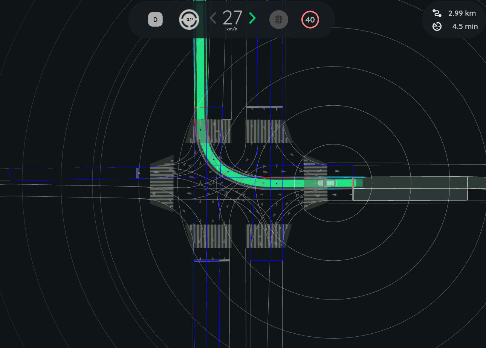
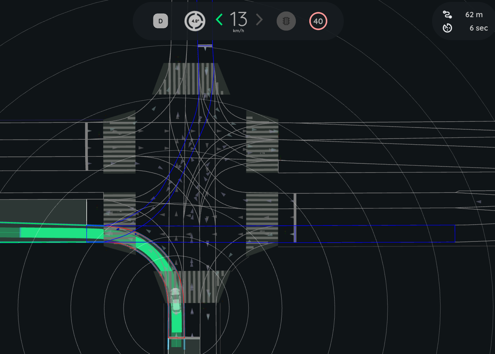

# Intersection Collision Checker

The `intersection_collision_checker` is a plugin module of `autoware_planning_validator` node. It is responsible for validating the planning trajectory at intersections by verifying that it does NOT lead to a collision with other road vehicles.

The check is executed only when:

- Ego is approaching a `turn_direction` lane
- Ego trajectory intersects with lanes other than `route_lanelets`

## Inner workings

The following steps describe the general approach taken to check for collisions at intersections:

- Compute ego trajectory lanelets and turning direction
- Compute target lanelets to check
- For each target lanelet set the `point_of_overlap` (i.e where ego trajectory intersects the lanelet), and compute ego's time to reach it.
- Filter obstacle pointclouds to remove unwanted points
- For each target lanelet:
  - process pointcloud points within lanelet and measure distance to `point_of_overlap`
  - estimate object velocity based on changes in distance measurements
  - estimate object's time to reach `point_of_overlap`
  - compare object's and ego's time to reach to determine if there is a risk of collision.

If it's determined that there is a risk of collision, a diagnostic is published to trigger an emergency stop by the MRM Handler.

### Target Lanelet Selection

#### Right turn

To get the target lanelets, we first find all lanelets intersecting with ego trajectory. Then we filter out:

- Lanelets that are `route_lanelets`
- Lanelets with a "time to reach" exceeding the time horizon
- Lanelets that have `turn_direction` attribute and are not `STRAIGHT`. (If parameter `right_turn.check_turning_lanes` is **FALSE**)

Target lenelets are then expanded, if necessary, up to `detection_range`

The image below shows the target lanelets at a righ turn intersection. (`right_turn.check_turning_lanes` set to False)

#### Left turn

To get the target lanelets in case of a left turn:

- First we find the `turn_direction` lanelet from the Ego trajectory lanelets
- Then we find the next lanelet "destination_lanelet" following the `turn_direction` lanelet
- We then get all lanelets preceding the "destination_lanelet" and filter out:
  - Lanelets that are `route_lanelets`
  - Lanelets with a "time to reach" exceeding the time horizon
  - Lanelets that have `turn_direction` attribute and are not `STRAIGHT`. (If parameter `left_turn.check_turning_lanes` is **FALSE**)

Target lenelets are then expanded, if necessary, up to `detection_range`

The image below shows the target lanelets at a left turn intersection. (`left.check_turning_lanes` set to **TRUE**)

