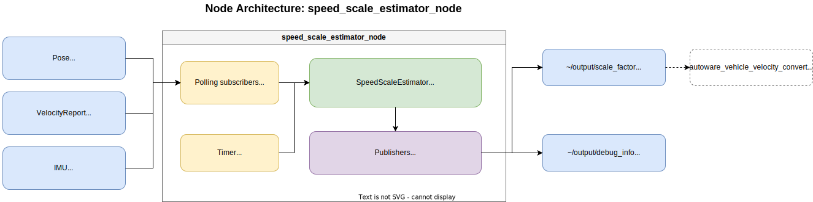
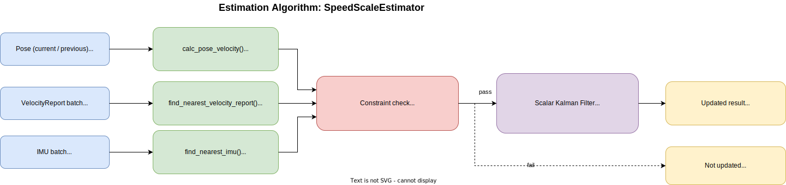

# autoware_speed_scale_estimator

## Overview

This package estimates the vehicle speed scale factor by comparing pose-derived velocity from consecutive localization poses with wheel velocity reported by the vehicle. The reference velocity is computed from pose position differences (e.g. NDT scan matcher output), so the estimate reflects consistency between localization motion and wheel speed.

The estimated scale factor can be used to monitor and tune the speed scale in `autoware_vehicle_velocity_converter`. The node runs periodically at `update_interval` and updates the estimate only when all operational constraints are satisfied.

## Package Architecture

The package is split into a core library (separated from ROS node I/O) and a ROS adapter layer:

| Layer | Library                              | Responsibility                                                                                           |
| ----- | ------------------------------------ | -------------------------------------------------------------------------------------------------------- |
| Core  | `autoware_speed_scale_estimator`     | Utils, Kalman filter estimation (`SpeedScaleEstimator`)                                                  |
| ROS   | `autoware_speed_scale_estimator_ros` | Message handling, debug formatting, node I/O (`SpeedScaleEstimatorProcessor`, `SpeedScaleEstimatorNode`) |

Core algorithms can be unit-tested without spinning up a ROS graph.

## Block Diagram

### Node architecture

ROS node interfaces and publish timing.

### Estimation algorithm

Internal processing flow inside `SpeedScaleEstimator`.

## Algorithm

The speed scale estimation follows these steps:

### 1. Data Collection

- Collects pose (`PoseStamped`), IMU, and vehicle velocity reports (`VelocityReport`) received since the previous timer callback
- Keeps IMU and velocity report messages in rolling buffers of length `sensor_buffer_duration` for timestamp synchronization
- Keeps the previous pose internally to compute pose velocity between consecutive updates

### 2. Pose Velocity Calculation

Computes pose velocity from the previous and current poses:

$$
v_{pose} = \frac{\| \Delta \mathbf{p} \|}{\Delta t}
$$

If the time difference between the two poses exceeds `max_pose_lag`, the previous pose is reset and estimation is skipped.

### 3. Timestamp Synchronization

For the current pose timestamp, the estimator selects from the rolling buffers:

- the nearest IMU sample for angular velocity constraint checking
- the nearest velocity report for Kalman filter observation

Estimation is skipped when either timestamp difference exceeds `max_stamp_lag`.

### 4. Constraint Validation

Estimation is performed only when all of the following constraints are satisfied:

- **Angular velocity constraint (IMU)** — $|\omega_{imu}| \leq \omega_{max}$

  Default $\omega_{max} \approx 0.6\ \mathrm{deg/s}$ ($0.0105\ \mathrm{rad/s}$) rejects obvious curves and turns. This threshold is set near the practical IMU bias/noise floor rather than fine straight-line discrimination.

- **Speed constraints (pose velocity)** — $v_{min} \leq v_{pose} \leq v_{max}$

  Default $v_{min} = 6.0\ \mathrm{m/s}$ improves pose-differentiation SNR. Default $v_{max} = 17.0\ \mathrm{m/s}$ filters out extreme speeds. Together with $\omega_{max}$, estimation runs mainly on moderate-speed, near-straight segments.

- **Wheel velocity validity** — $|v_{wheel}| > 10^{-6}$

### 5. Scale Factor Estimation (Kalman Filter)

The scale factor is modeled as a scalar state $x$ with the observation:

$$
z = v_{pose} = x \cdot v_{wheel}
$$

Kalman filter update:

**Prediction:**

$$
x_{pred} = x,\quad P_{pred} = P + Q
$$

**Update:**

$$
H = v_{wheel},\quad y = z - H x_{pred}
$$

$$
S = H^2 P_{pred} + R,\quad K = \frac{P_{pred} H}{S}
$$

$$
x = x_{pred} + K y,\quad P = (1 - K H) P_{pred}
$$

## Inputs / Outputs

### Input Topics

| Name                      | Type                                         | Description                               |
| ------------------------- | -------------------------------------------- | ----------------------------------------- |
| `~/input/pose`            | `geometry_msgs::msg::PoseStamped`            | Localization pose (e.g. NDT scan matcher) |
| `~/input/velocity_report` | `autoware_vehicle_msgs::msg::VelocityReport` | Vehicle velocity report                   |
| `~/input/imu`             | `sensor_msgs::msg::Imu`                      | IMU sensor data                           |

### Output Topics

| Name                    | Type                                                | Description                                                        |
| ----------------------- | --------------------------------------------------- | ------------------------------------------------------------------ |
| `~/output/scale_factor` | `autoware_internal_debug_msgs::msg::Float32Stamped` | Estimated speed scale factor (published on successful update only) |
| `~/output/debug_info`   | `autoware_internal_debug_msgs::msg::StringStamped`  | Debug information (published every timer callback)                 |

## Parameters

{{ json_to_markdown("localization/autoware_speed_scale_estimator/schema/speed_scale_estimator.schema.json") }}

### Tuning

Default constraint values are a practical starting point, not vehicle-specific optima. If estimation accuracy is insufficient, tune `max_pose_lag`, `max_stamp_lag`, `sensor_buffer_duration`, `max_angular_velocity`, `min_speed`, `max_speed`, and Kalman noise parameters per vehicle and operation. IMU bias cancellation or other preprocessing may allow a stricter angular velocity threshold; without it, thresholds near the IMU noise floor are expected.
