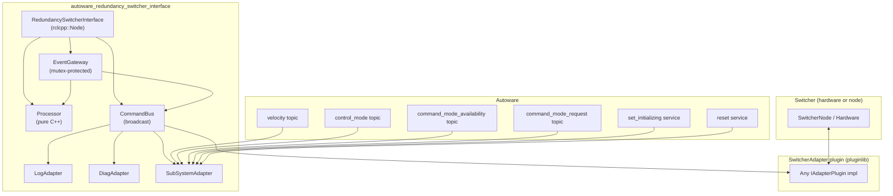
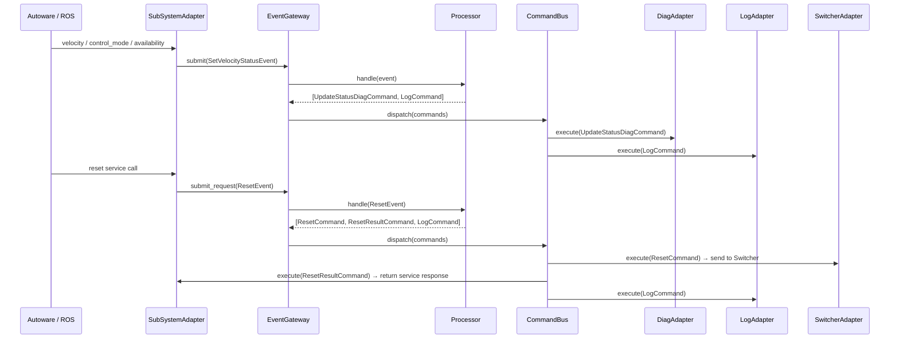
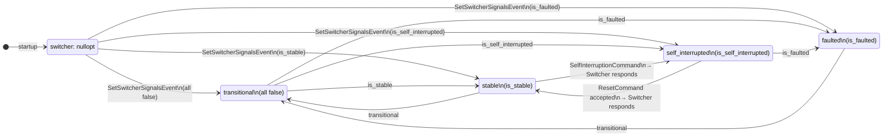
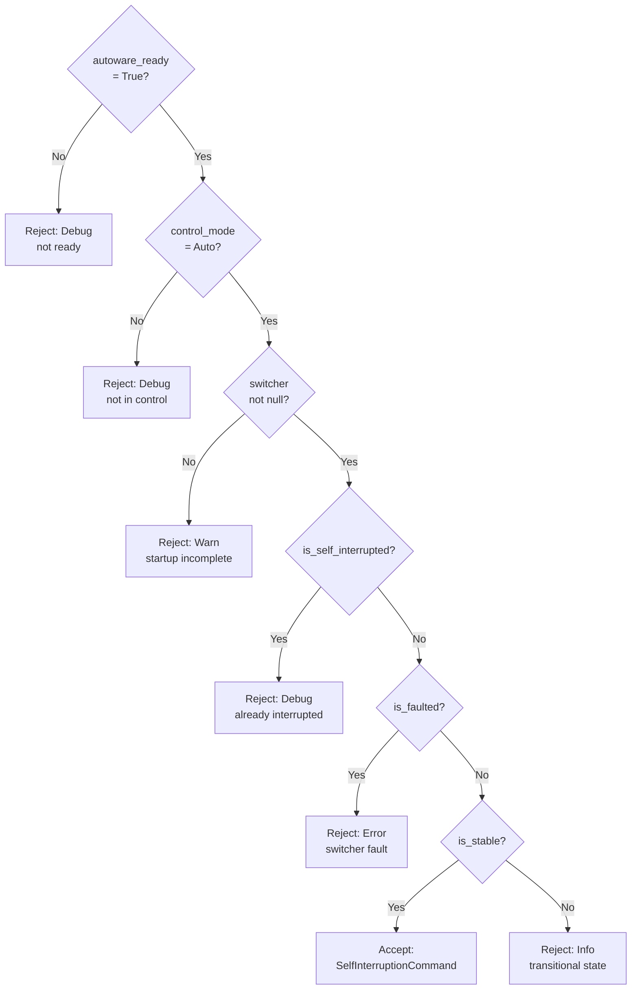
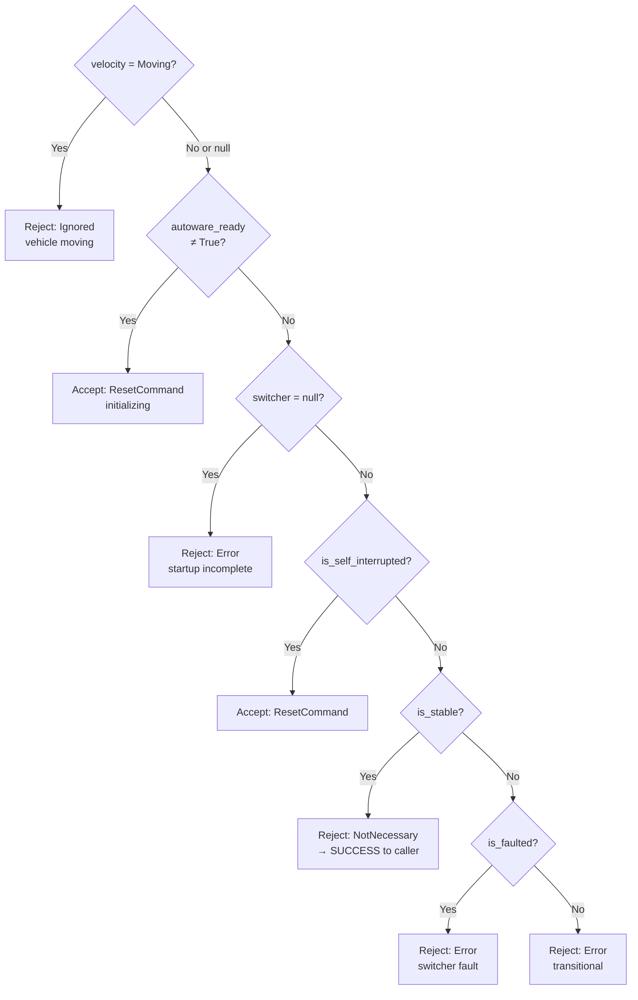
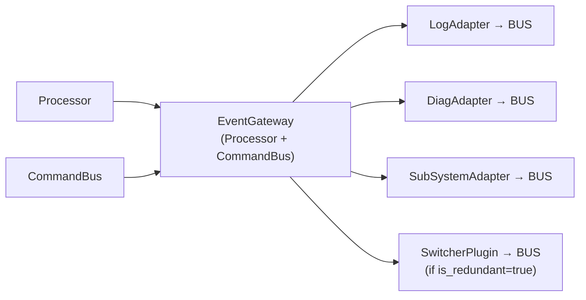

# Detailed Design — autoware_redundancy_switcher_interface

## 1. Package Overview

This package provides the core framework. The Switcher-side adapter is loaded at runtime as a
pluginlib plugin; the framework has no knowledge of which plugin is used or its internal protocol.

| Package                                          | Location           | Role                                                            |
| ------------------------------------------------ | ------------------ | --------------------------------------------------------------- |
| `autoware_redundancy_switcher_interface`         | `universe/system/` | Core framework: Processor, EventGateway, built-in adapters      |
| `autoware_redundancy_switcher_interface_plugins` | `universe/system/` | Default topic-based SwitcherAdapter plugin + SimpleSwitcherNode |

> Plugin implementations that use hardware-specific transports (e.g., UDS) are maintained
> as separate packages and document their own design independently.

---

## 2. File Structure

### autoware_redundancy_switcher_interface

```
include/redundancy_switcher_interface/
  core_logic/
    i_processor.hpp        — IProcessor interface (pure virtual)
    processor.hpp          — Processor class declaration
  ir/
    domain_types.hpp       — SwitcherSignals, DomainSnapshot, enums, Annotated<E>
    input_events.hpp       — InputEvent variant (all event types)
    output_commands.hpp    — OutputCommand variant (all command types)
  plugin/
    command_bus.hpp        — CommandBus: broadcast OutputCommands to adapters
    event_gateway.hpp      — EventGateway: thread-safe event submission
    i_adapter_plugin.hpp   — IAdapterPlugin interface (pluginlib base)
src/
  processor.cpp            — Processor state machine implementation
  redundancy_switcher_interface.hpp / .cpp  — ROS node, wiring
  diag_adapter.hpp / .cpp  — Built-in: publishes aggregated diagnostics (see Section 12)
  log_adapter.hpp / .cpp   — Built-in: logs all OutputCommands
  subsystem_adapter.hpp / .cpp  — Built-in: ROS I/O with Autoware stack
docs/
  REQUIREMENTS.md          — Functional requirements
  DESIGN.md                — This document
  TERMINOLOGY.md           — Term definitions and data flow
  ADAPTER_THREAD_SAFETY.md — Thread safety guide for adapter plugin authors
```

### autoware_redundancy_switcher_interface_plugins

```
src/
  switcher_adapter.hpp / .cpp      — SimpleSwitcherAdapter plugin
  simple_switcher_node.hpp / .cpp  — Companion stateful switcher node
config/
  default.param.yaml               — switcher_plugin class name
  simple_switcher_node.param.yaml  — ECU IDs, publish period
docs/
  SIMPLE_SWITCHER_PLUGIN_DESIGN.md
```

---

## 3. Architecture Overview



---

## 4. Data Flow



---

## 5. Processor State Machine

The Processor maintains a `DomainSnapshot` — five optional fields that are `nullopt` until first received.



---

## 6. Event Processing Conditions

### 6.1 SelfInterruptionEvent



### 6.2 ResetEvent



---

## 7. InputEvent List

| Event                                   | Submitted by           | Payload                      | Processor action                                                                                 |
| --------------------------------------- | ---------------------- | ---------------------------- | ------------------------------------------------------------------------------------------------ |
| `SelfInterruptionEvent`                 | SubSystemAdapter       | —                            | Evaluate conditions; emit SelfInterruptionCommand if accepted                                    |
| `ResetEvent`                            | SubSystemAdapter       | —                            | Evaluate conditions; emit ResetCommand + ResetResultCommand                                      |
| `SetAutowareReadyEvent`                 | SubSystemAdapter       | `AutowareReady` (False/True) | Update `autoware_ready`; emit UpdateAutowareReadyCommand + diag + log                            |
| `SetVelocityStatusEvent`                | SubSystemAdapter       | `VelocityStatus`             | Update `velocity_status`; emit diag + log if changed                                             |
| `SetControlModeEvent`                   | SubSystemAdapter       | `ControlMode`                | Update `control_mode`; emit diag + log if changed                                                |
| `SetSwitcherSignalsEvent`               | SwitcherAdapter plugin | `SwitcherSignals`            | Update `switcher`; force active_unit empty if interrupted/faulted; emit diag + log if changed    |
| `SetActiveControlUnitEvent`             | SwitcherAdapter plugin | `ActiveControlUnit`          | If not interrupted/faulted: emit UpdateActiveControlUnitCommand                                  |
| `SetAnotherEcuAvailabilityTimeoutEvent` | SubSystemAdapter       | `bool timed_out`             | Update `another_ecu_availability_timeout`; emit UpdateAnotherEcuAvailabilityTimeoutCommand + log |

Each event carries an `Annotated<T>` value: the payload `T` plus a human-readable annotation string.
The annotation content is defined by the submitting adapter; the Processor only stores it.

---

## 8. OutputCommand List

| Command                                      | Handled by             | Meaning                                                                 |
| -------------------------------------------- | ---------------------- | ----------------------------------------------------------------------- |
| `LogCommand`                                 | LogAdapter             | Emit a log message at the specified level (Debug/Info/Warn/Error/Fatal) |
| `ResetCommand`                               | SwitcherAdapter plugin | Send a reset request to the Switcher                                    |
| `SelfInterruptionCommand`                    | SwitcherAdapter plugin | Send a self-interruption request to the Switcher                        |
| `UpdateStatusDiagCommand`                    | DiagAdapter            | Trigger a diagnostic update (DiagAdapter reads snapshot via gateway)    |
| `UpdateActiveControlUnitCommand`             | SubSystemAdapter       | Publish the active control unit message                                 |
| `UpdateAutowareReadyCommand`                 | SwitcherAdapter plugin | Update the plugin's local `autoware_ready` cache                        |
| `ResetResultCommand`                         | SubSystemAdapter       | Return accept/reject result of a reset request to the service caller    |
| `UpdateAnotherEcuAvailabilityTimeoutCommand` | SwitcherAdapter plugin | Update the plugin's local peer-ECU timeout state cache                  |

---

## 9. Interface Definitions

### 9.1 ROS Topics / Services (SubSystemAdapter)

| Direction | Name                                | Type                      | Description                                    |
| --------- | ----------------------------------- | ------------------------- | ---------------------------------------------- |
| Subscribe | `~/input/velocity`                  | `VelocityReport`          | Vehicle velocity                               |
| Subscribe | `~/input/control_mode`              | `ControlModeReport`       | Autoware control mode                          |
| Subscribe | `~/input/command_mode_request`      | `CommandModeRequest`      | Command mode request (main ECU only)           |
| Subscribe | `~/input/command_mode_availability` | `CommandModeAvailability` | Availability from peer ECU                     |
| Publish   | `~/output/active_control_unit`      | `ActiveControlUnit`       | Currently active ECU/VCU                       |
| Service   | `~/set_initializing`                | `std_srvs/SetBool`        | Set Autoware readiness (data=true → not ready) |
| Service   | `~/service/reset`                   | `ResetRedundancySwitcher` | Reset self-interruption state                  |

### 9.2 ROS Topics / Services (SimpleSwitcherAdapter + SimpleSwitcherNode)

| Direction | Name                                                                | Type                | Description                                                                 |
| --------- | ------------------------------------------------------------------- | ------------------- | --------------------------------------------------------------------------- |
| Subscribe | `/system/simple_switcher/status/active_control_unit`                | `ActiveControlUnit` | Active unit from switcher node                                              |
| Subscribe | `/system/simple_switcher/status/switcher_signals/{main,sub}_ecu`    | `UInt8`             | Encoded switcher signals (bit0=stable, bit1=self_interrupted, bit2=faulted) |
| Subscribe | `/system/simple_switcher/status/switcher_annotation/{main,sub}_ecu` | `String`            | Human-readable state annotation                                             |
| Publish   | `/system/simple_switcher/request/reset`                             | `Empty`             | Reset request to switcher node                                              |
| Publish   | `/system/simple_switcher/request/self_interruption/{main,sub}_ecu`  | `Empty`             | Self-interruption request                                                   |
| Service   | `/system/simple_switcher/input/manual_active_control_unit`          | `SetBool`           | Manual override (true=Main ECU, false=Sub ECU)                              |

### 9.3 IAdapterPlugin

```cpp
class IAdapterPlugin {
  // Initialize ROS resources. Called once at node startup.
  virtual void initialize(rclcpp::Node* node, std::shared_ptr<EventGateway> gateway) = 0;

  // Execute an OutputCommand. Called for every command by CommandBus.
  // Must ignore types this adapter does not own.
  // Must NOT call gateway->submit() synchronously (deadlock risk).
  virtual void execute(const OutputCommand& command) = 0;
};
```

---

## 10. Component Wiring (RedundancySwitcherInterface node)



When `is_redundant=false`, no plugin is loaded. Instead, `SetSwitcherSignalsEvent{is_stable=true}`
is submitted once at startup, making the Processor behave as permanently stable.

---

## 11. Thread Safety

```
EventGateway.mutex_
  Serializes: Processor::handle()
  Outside lock: CommandBus::dispatch() → adapter::execute()

SubSystemAdapter.state_mutex_
  Protects: last_command_mode_request_, availability timeout state

DiagAdapter.updater_mutex_
  Protects: diagnostic_updater::force_update()

DiagAdapter.transition_mutex_
  Protects: stamp_transitional_start_
```

**Rule**: Never call `gateway->submit()` while holding any adapter mutex. See
[ADAPTER_THREAD_SAFETY.md](ADAPTER_THREAD_SAFETY.md) for plugin authoring guidelines.

---

## 12. DiagAdapter — Diagnostic Output

DiagAdapter publishes one `diagnostic_updater` item triggered by every `UpdateStatusDiagCommand`
(i.e., on every Processor state change).

### Hardware ID

| `is_main_ecu` | Hardware ID                              |
| ------------- | ---------------------------------------- |
| true          | `main_ecu_redundancy_switcher_interface` |
| false         | `sub_ecu_redundancy_switcher_interface`  |

### Diagnostic item

**Name**: `redundancy_switcher_interface_status`

Four key-value fields are added to the diagnostic status:

| Key                | Value content                                                               |
| ------------------ | --------------------------------------------------------------------------- |
| `switcher_signals` | Current switcher state and annotation (e.g., `"Switcher stable: ... (OK)"`) |
| `autoware_ready`   | Whether Autoware is ready for switching (e.g., `"Autoware is ready (OK)"`)  |
| `velocity_status`  | Vehicle stopped/moving (e.g., `"Vehicle is stopped (OK)"`)                  |
| `control_mode`     | Manual/Autoware control (e.g., `"Autoware control mode (OK)"`)              |

The summary level is the **worst** level across all four fields.

### Level mapping per field

**switcher_signals:**

| Condition                      | Level | Summary message                                                |
| ------------------------------ | ----- | -------------------------------------------------------------- |
| `nullopt` (no data received)   | WARN  | `"Startup not yet complete: awaiting switcher data"`           |
| `is_faulted`                   | ERROR | `"Switcher fault: <annotation>"`                               |
| `is_self_interrupted`          | WARN  | `"Self-interruption occurred: <annotation>"`                   |
| `is_stable`                    | OK    | `"Switcher stable: <annotation>"`                              |
| transitional, within timeout   | WARN  | `"Switcher in transitional state: <annotation>"`               |
| transitional, timeout exceeded | ERROR | `"Switcher transitional state too long (<N>ms): <annotation>"` |

The transitional timeout threshold is `diag.transitional_timeout_milli` (ms).
The timer starts when the switcher first enters the transitional state and resets on any non-transitional state.

**autoware_ready:**

| Condition         | Level |
| ----------------- | ----- |
| `nullopt`         | WARN  |
| `False` or `True` | OK    |

**velocity_status:**

| Condition             | Level |
| --------------------- | ----- |
| `nullopt`             | WARN  |
| `Stopped` or `Moving` | OK    |

**control_mode:**

| Condition          | Level |
| ------------------ | ----- |
| `nullopt`          | WARN  |
| `Manual` or `Auto` | OK    |
