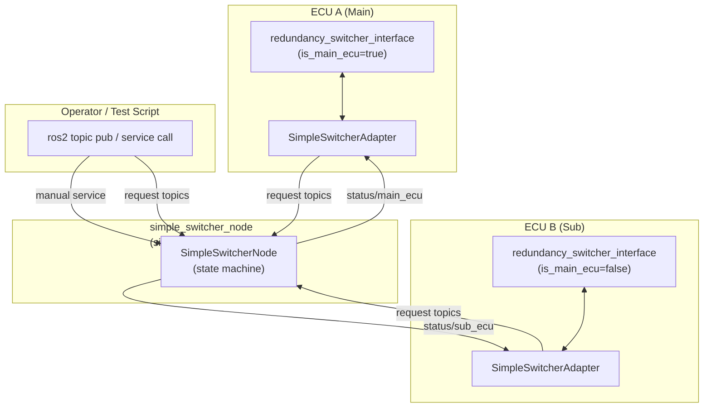
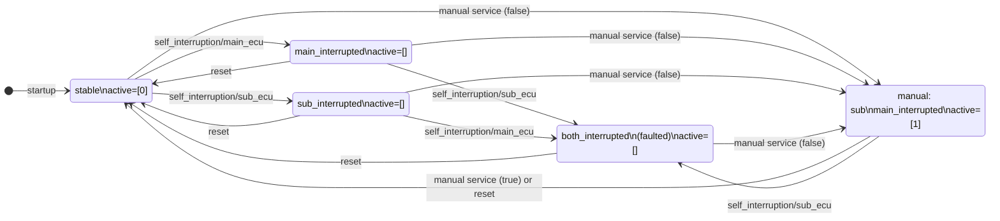
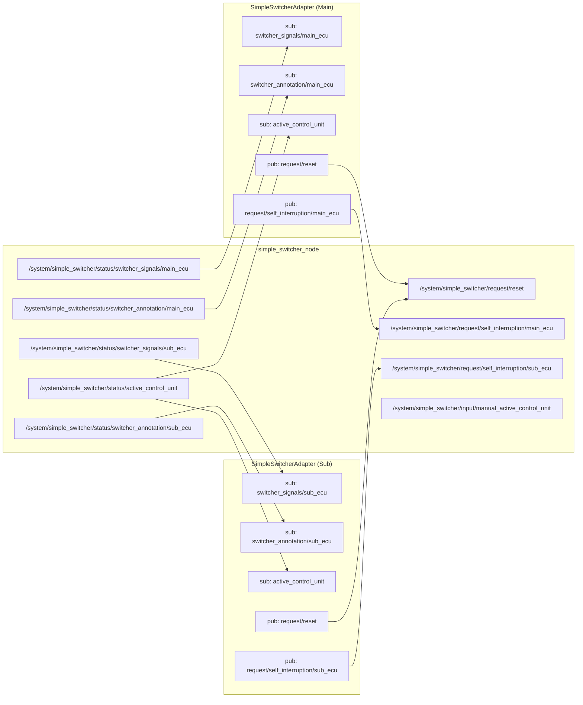

# Detailed Design — autoware_redundancy_switcher_interface_plugins

## 1. Purpose and Background

This document covers `SimpleSwitcherAdapter`, the **desktop mock** adapter in this package.

In production, ECU leader election is performed by dedicated switching hardware
([redundancy_switcher](https://github.com/tier4/redundancy_switcher)) and communicated via UDS
sockets using `RedundancySwitcherAdapter`. On a development machine or in CI, that hardware and its
protocol are unavailable. `SimpleSwitcherAdapter` provides a ROS-topic-based substitute that
implements the same `SwitcherSignals` contract without any hardware dependency.

**What it replaces**: `RedundancySwitcherAdapter` (UDS-connected hardware switcher).

**What it does not simulate**: Leader election algorithms, VCU handling, or any transport-level
protocol. State transitions are driven exclusively by explicit ROS topic/service requests.

---

## 2. System Overview



`simple_switcher_node` is a single node shared by both ECU interface nodes.
Each `SimpleSwitcherAdapter` subscribes to the per-ECU status topics and publishes to the
shared request topics.

---

## 3. File Structure

```
src/
  switcher_adapter.hpp / .cpp              — SimpleSwitcherAdapter (this document)
  simple_switcher_node.hpp / .cpp          — Mock switcher node (ROS component)
  redundancy_switcher_adapter.hpp / .cpp   — RedundancySwitcherAdapter (UDS / redundancy_switcher)
  non_redundant_adapter.hpp / .cpp         — NonRedundantSwitcherAdapter (single-ECU)
  uds_types.hpp                            — ElectionRequest / ElectionStatus protocol types
  uds_receiver.hpp / uds_sender.hpp        — UDS DGRAM socket transport (header-only templates)
config/
  default.param.yaml                       — SimpleSwitcherAdapter plugin class name
  simple_switcher_node.param.yaml          — ECU IDs, publish period
  redundancy_switcher.main.param.yaml      — RedundancySwitcherAdapter, Main ECU
  redundancy_switcher.sub.param.yaml       — RedundancySwitcherAdapter, Sub ECU
  non_redundant.param.yaml                 — NonRedundantSwitcherAdapter
launch/
  simple_switcher_node.launch.xml          — Launch simple_switcher_node
docs/
  DESIGN.md                                — This document (SimpleSwitcherAdapter)
```

---

## 4. Topic and Service Interface

### 4.1 Requests → simple_switcher_node

| Topic / Service | Type | Sender | Effect |
|---|---|---|---|
| `/system/simple_switcher/request/reset` | `std_msgs/Empty` | SimpleSwitcherAdapter (via ResetCommand) or operator | Reset all interruption flags; active=Main |
| `/system/simple_switcher/request/self_interruption/main_ecu` | `std_msgs/Empty` | SimpleSwitcherAdapter (via SelfInterruptionCommand, is_main_ecu=true) or operator | Set main_interrupted=true |
| `/system/simple_switcher/request/self_interruption/sub_ecu` | `std_msgs/Empty` | SimpleSwitcherAdapter (via SelfInterruptionCommand, is_main_ecu=false) or operator | Set sub_interrupted=true |
| `/system/simple_switcher/input/manual_active_control_unit` | `std_srvs/SetBool` | Operator (DomainID1) | Manual override: true=Main, false=Sub (sets main_interrupted=true) |

> The manual service is not bridged in the sub-domain bridge configuration, as it is
> intended for operator use from DomainID1 only.

### 4.2 Status ← simple_switcher_node

| Topic | Type | Subscriber | Content |
|---|---|---|---|
| `/system/simple_switcher/status/active_control_unit` | `ActiveControlUnit` | SimpleSwitcherAdapter | Active ECU IDs |
| `/system/simple_switcher/status/switcher_signals/main_ecu` | `std_msgs/UInt8` | SimpleSwitcherAdapter (is_main_ecu=true) | Encoded SwitcherSignals for Main ECU |
| `/system/simple_switcher/status/switcher_signals/sub_ecu` | `std_msgs/UInt8` | SimpleSwitcherAdapter (is_main_ecu=false) | Encoded SwitcherSignals for Sub ECU |
| `/system/simple_switcher/status/switcher_annotation/main_ecu` | `std_msgs/String` | SimpleSwitcherAdapter (is_main_ecu=true) | Human-readable state annotation |
| `/system/simple_switcher/status/switcher_annotation/sub_ecu` | `std_msgs/String` | SimpleSwitcherAdapter (is_main_ecu=false) | Human-readable state annotation |

**switcher_signals bit encoding:**

| Bit | Signal |
|---|---|
| bit0 | `is_stable` |
| bit1 | `is_self_interrupted` |
| bit2 | `is_faulted` |

---

## 5. simple_switcher_node State Machine

### 5.1 State Variables

| Variable | Type | Initial value |
|---|---|---|
| `main_interrupted_` | bool | false |
| `sub_interrupted_` | bool | false |
| `active_ids_` | vector\<uint8_t\> | `[0]` (Main ECU) |

### 5.2 Derived Signals (per ECU)

| Signal | Condition |
|---|---|
| `faulted` | `main_interrupted && sub_interrupted` |
| `self_interrupted` | `(main_interrupted \|\| sub_interrupted) && !faulted` |
| `stable` | `!self_interrupted && !faulted` |

Main ECU and Sub ECU receive per-ECU signals that reflect which side is interrupted.

### 5.3 State Transitions



### 5.4 Event Details

| Event | `main_interrupted_` | `sub_interrupted_` | `active_ids_` | annotation |
|---|---|---|---|---|
| `self_interruption/main_ecu` | true | unchanged | `[]` or `[sub]` if sub healthy | `"self_interrupted by=main ..."` |
| `self_interruption/sub_ecu` | unchanged | true | `[]` or `[main]` if main healthy | `"self_interrupted by=sub ..."` |
| `reset` | false | false | `[main]` | `"stable active=main (reset)"` |
| manual service (true) | false | false | `[main]` | `"manual override active=main"` |
| manual service (false) | **true** | false | `[sub]` | `"manual override active=sub main_fault=true"` |

> Manual service with `data=false` (Sub ECU) sets `main_interrupted=true`. This is intentional:
> forcing Sub active implies Main has been declared faulted by the operator.

---

## 6. SimpleSwitcherAdapter

The adapter bridges the interface framework and `simple_switcher_node`.

### 6.1 Inbound (status → EventGateway)

| Received topic | Submitted event |
|---|---|
| `status/active_control_unit` | `SetActiveControlUnitEvent` |
| `status/switcher_signals/{main,sub}_ecu` + cached annotation | `SetSwitcherSignalsEvent` |
| `status/switcher_annotation/{main,sub}_ecu` | cached in `latest_annotation_` (used on next signals message) |

The adapter subscribes to the per-ECU topics determined by `is_main_ecu`.

### 6.2 Outbound (CommandBus → request topics)

| Received command | Published topic |
|---|---|
| `ResetCommand` | `/system/simple_switcher/request/reset` |
| `SelfInterruptionCommand` (is_main_ecu=true) | `/system/simple_switcher/request/self_interruption/main_ecu` |
| `SelfInterruptionCommand` (is_main_ecu=false) | `/system/simple_switcher/request/self_interruption/sub_ecu` |
| All other commands | ignored |

### 6.3 Annotation Handling

The annotation string and the signals value arrive on separate topics. The adapter caches
the latest annotation under `annotation_mutex_` and attaches it to the next
`SetSwitcherSignalsEvent`. This means annotation and signals are slightly decoupled in time,
but since both are published in sequence by `simple_switcher_node::publish_status()`, the lag
is negligible in practice.

---

## 7. Connection Diagram (full topic graph)



---

## 8. Configuration Parameters

### simple_switcher_node (`config/simple_switcher_node.param.yaml`)

| Parameter | Default | Description |
|---|---|---|
| `main_ecu_id` | 0 | ECU ID for Main ECU |
| `sub_ecu_id` | 1 | ECU ID for Sub ECU |
| `publish_period_ms` | 200 | Periodic status publish interval (ms) |

### SimpleSwitcherAdapter (`config/default.param.yaml`)

| Parameter | Value | Description |
|---|---|---|
| `switcher_plugin` | `"autoware::redundancy_switcher::SimpleSwitcherAdapter"` | pluginlib class name |

---

## 9. Limitations (Mock Scope)

The following are **intentionally not implemented**, as this is a desktop mock:

- Leader election algorithm
- Hardware failure detection (all faults are manually injected)
- VCU (Vehicle Control Unit) handling — only ECUs (IDs 0 and 1) are supported
- DDS/UDS transport
- Distributed consistency between physically separate machines (all nodes run on the same host)
